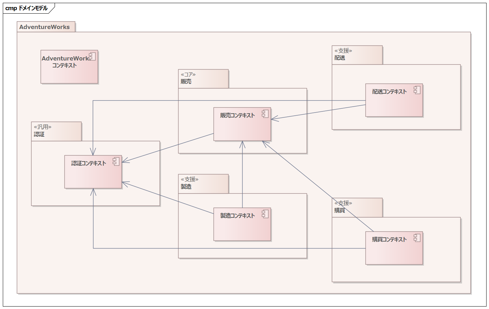

さて、これでドメイン間の関係は整理できたように思います。ただ個人的にはもう1つの要素を追加するのが好みです。

販売・配送・製造・購買・認証の上位概念としてAdventureWorksドメインとそのコンテキストを定義します。

たとえばAdventureWorks社のビジネスを考えたときに、認証以外のすべてのドメインでお金の概念が必要となるでしょう。当然税率の概念も付随してきて、有効桁数外の計算に頭を悩まされることになるでしょう。AdventureWorksコンテキストにそういった共通する概念を定義することはスマートな解決だと思います。

このときAdventureWorksコンテキストに定義するものは十分な注意が必要です。

たとえば製品という「言葉」も認証コンテキスト以外に登場するでしょう。しかしこれをAdventureWorksコンテキストに定義してしまったらモノリシックなシステムに逆戻りです。製品は一見どのコンテキストにも登場するように思いますが、実際のところドメインごとに製品対する見方はまったく異なります。

販売コンテキストでは、顧客に商品を説明するための画像や文書が大切でしょうし、価格も通常価格とは別にセールなども考慮する必要があり、それは該当のコンテキストで非常に重要なものです。

しかし製造コンテキストで興味があるのはは製造手順や製造日数で、そしてそれらは配送コンテキストには必要ないものです。

現実的にまったく同じものを指していても、ドメインによって注視する部分がことなる、見え方がことなるのであれば各ドメインのコンテキストに定義するべきです。

ではすべて個別のコンテキストに定義するべきかというと、それもまたそうではありません。intやstringといったオブジェクトを個別のドメインで再定義するべきでしょうか？私は、そうは思いません。

オブジェクトは目的や用途が完全に一致するスコープで定義するべきです。現実に同じものであっても個別のコンテキストで定義すべきものもあれば、個別のコンテキストで定義はせず、共通のコンテキストで定義すべきものもあります。それぞれのドメインの業務から見たときに、まったく同じように見えるものかどうかで判断する必要があります。

# アーキテクチャの2つのフェーズ

さて、本稿ではアーキテクチャの設計は大きくつぎの2つのフェーズに分けて行います。

1. 予算決定のためのアーキテクチャ
2. 開発時のアーキテクチャ

良いシステムを作るために絶対必要なものが良いチーム意外に2つあります。十分な予算と、十分な開発期間です。

この2つを獲得するためには、予算が決定される前に関与し、予算にアーキテクチャを反映させる必要があります。お金が無ければ、なにも自由になりません。世知辛いけど事実です。

受託開発であれば当然ですが、自社プロダクト開発の場合は、プロダクトの採算性に影響を与えるため、やはり必要なことです。

もちろんすべてを決める必要はありませんが、後からあれが足りない、これが足りないとならないために決めるべきことがあります。今回はおもに予算決定のためのアーキテクチャについて記載いたします。

ちなみにいわゆる見積の期間というのは十分な時間がなかなか取れないものです。短い時間のなかで決めるべきことを決めるためのコツが1つだけあります。

「見積れと言われる前にアーキテクチャを決めておく」ことです。

実際、見積時に技術的な実現性を評価できるだけの時間をとれることは稀です。これはむしろ「実現可能がまったく分からない」「できはするが、どれだけ性能がでるか全然わからない」くらいの、投資が全部むだになるくらいの不確定さであればPoCが計画できます。しかし「採用したいものがあるが、採用したときのリスクが評価できていない。さらに採用にはお金がかかる上に、採用しなくても作れないわけではない」みたいな技術は、「見積って」と言われてからでは大変厳しいでしょう。

皆さんの次の開発時のアーキテクチャ決定の一助になることが、本稿の1つの目的でもあります。
