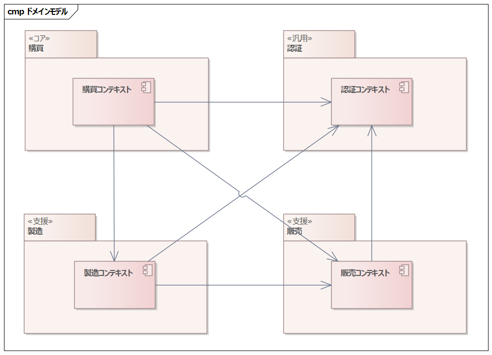
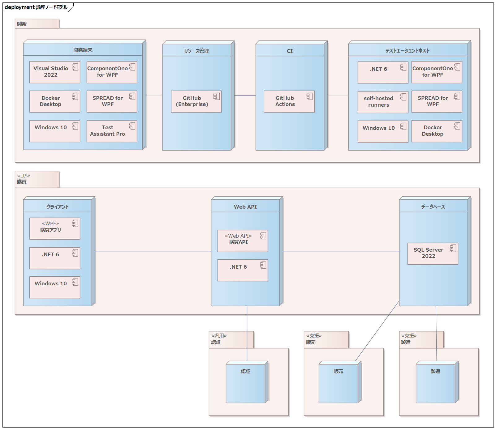
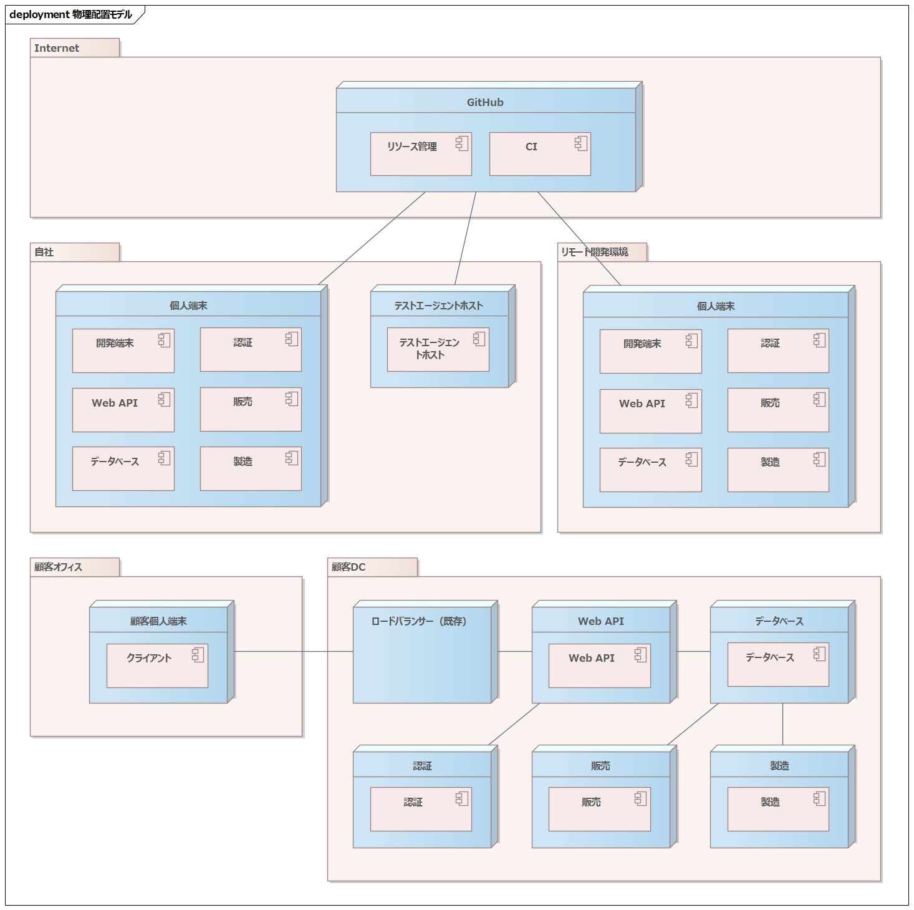

2022年版実践WPF業務アプリケーションのアーキテクチャ【見積編】 ～ ドメイン駆動設計＆Clean Architectureとともに ～

# リード文（400字以内）

2018年4月、「[実践WPF業務アプリケーションのアーキテクチャ](https://codezine.jp/article/detail/10727)」としてサンプルアーキテクチャを公開しました。あれから4年、見返してみると大分考えに変化がありました。

現在、ドメイン駆動設計やClean Architectureなどが日本でも良く語られるようになり、ひろく受け入れられ始められています。技術的にはWPFも .NET Frameworkだけでなく .NET上でも動作するようになりました。筆者もそれらを取り入れて開発しています。

本稿ではマイクロソフトが架空の大規模多国籍製造企業を想定し公開している、サンプルデータベース「AdventureWorks」を題材に、グレープシティのコンポーネント「[ComponentOne for WPF](https://www.grapecity.co.jp/developer/componentone)」や「[SPREAD for WPF](https://www.grapecity.co.jp/developer/spread-wpf)」を活用して業務アプリケーション開発をする際のアーキテクチャを紹介します。

# はじめに

さて、タイトルをみて疑問を持った方もいらっしゃるのではないでしょうか。

「見積編？」

と。

2018年に書かせていただいた「[実践WPF業務アプリケーションのアーキテクチャ](https://codezine.jp/article/detail/10727)」に決定的に欠けていた視点がありました。

それはClean Architectureでも、DDDでもなければ .NET 6でもありません。これらのアーキテクチャは今後も変わり続けていきます。それは欠けた視点ではなく、結論のない、より良いアーキテクチャを追求し続けた結果の変化でしかありません。

決定的に欠けていたのは、プロジェクト開始前にアーキテクチャ的にどのようなことを検討しなくてはならないか？という視点です。これは普遍的に必要なものです。

受託開発のようなプロジェクトであれば当然ですが、自社開発プロダクトであっても、計画時に仮説として採算計画を必ず立てます。ソフトウェア開発における自由度がもっとも高い時点は、予算が決定する前です。逆に言うと予算が決定されてしまうと、有償ツールや有償コンポーネント1つ買うのも苦労します。

アーキテクトの仕事は、アーキテクチャを決定することですが、自由にアーキテクチャを決定するためには、自由な採算が必要です。採算的裁量がもっとも高いのは、間違いなく予算決定前です。

しかし当然予算決定前というのは、要求がもっとも曖昧な時期です。その時点で厳密なアーキテクチャを決定することはできません。しかし予算は決めなくてはいけません。アーキテクチャ的などの点を、どのように検討・決定したらいいのでしょうか？

それとは別に、[前回](https://codezine.jp/article/detail/10727)からこれまでの間に浸透してきたClean ArchitectureやDDDと、WPFでどのように付き合うのが好ましいかも触れていきたいと思います。

また .NETの技術的な点で大きな変化のひとつにGeneric Hostの普及があります。これはクラウド開発が起点になっているもので、近年のモダンな .NET向けフレームワークやライブラリはGeneric Hostを前提としたものが増えてきています。WPFアプリケーションもGeneric Host上に開発することで、これらの恩恵を最大限活用できます。

本稿はそういった観点から、予算の決定される見積時から、プロジェクトが開始された後の具体的な設計時・実装時のアーキテクチャまでプロジェクトライフサイクル全体を通して、アーキテクチャをどのように検討しいったらよいか？その1つの案を提案いたします。

ぜひお付き合いください。

本稿が、アプリケーションを構築する上でのアーキテクチャについて、悩んでいる人への1つのヒントになれ幸いです。

なお、ここでいうアーキテクチャとは、ソフトウェア開発における技術的な重大な決定事項のすべてを指します。

# 本稿の内容について

本稿では、Microsoft社の公開しているSQL Serverのサンプルデータベース「AdventureWorks」を参考に、WPFで業務アプリケーションを構築するためのアーキテクチャを解説します。

AdventureWorksは販売・配送・製造・購買という、Adventure Works Cycles社のビジネス全体を対象としています。本稿ではこのうち、購買にスコープをあてて解説します。

アーキテクチャ的に、とくに重要なポイントとして下記の採用があります。

1. ドメイン駆動設計（以降DDD）
2. Clean Architecture
3. Generic Hostの採用
4. WPFの継続的インテグレーション（CI）におけるUI自動テスト

ほんとうはCDにも踏み込みたいのですが、WPFが採用されたプロダクトのCDについて私も現時点で試行錯誤中です。そのうち皆さんとお話しできる日を夢見つつ、今回は除外させていただきました。

本稿では、WPFでアプリケーションを構築する場合に、どのように要素を分解し、どう結合していくのか。アプリケーション構築時の大きな枠組みを中心に記載します。

そのため下記の内容については、サンプルとして一部実装されていますが主眼に置かれていません。

1. 各種コンポーネントの詳細な利用方法
2. バックエンドのアーキテクチャや実装

とくに後者については、WPF自体とは直接関連性がありません。近年の業務アプリケーションでもクラウドファーストが浸透してきているのを感じますが、クラウド上で本稿のサンプルを動作させようとした場合、WPFと関係性の薄いバックグラウンドをクラウドで動かすための説明が増えてしまいます。そこでサンプル上はクライアント・Web API・データベースの一般的な3層アーキテクチャとします。クラウドの知識が十分にあれば、応用してクラウドへシフトすることは難しくないでしょう。

# 前提条件

本稿は以下の環境を前提に記載しています。  

* Visual Studio 2022 Version 17.4.0
* Docker Desktop 4.14.0
* Docker version 20.10.20
* SQL Server 2022-latest(on Docker)
* [ComponentOne for WPF Edition 2022v2](https://www.grapecity.co.jp/developer/componentone/wpf)
* [SPREAD for WPF 4.0J](https://www.grapecity.co.jp/developer/spread-wpf)
* Test Assistant Pro 1.123
* .NET 6.0.11

本稿のサンプルは .NET 6で構築しますが、.NET Framework 4.6.2以上（.NET Standard 2.0水準以上）であれば同様のアーキテクチャで実現可能です。ただし一部利用しているパッケージのバージョンを当てなおす必要があるかもしれません。

# 想定読者

次の技術要素の基本をある程度理解していることを想定しています。

* C#  
* WPF  
* Docker
* SQL Server

これらの基本的な解説は、本稿では割愛しますが、知らないと理解できないという訳でもありません。

また下記の2つも概要は理解できていることが好ましいです。

* Clean Architecture
* ドメイン駆動設計

Clean Architectureについては、筆者のブログである「[世界一わかりやすいClean Architecture](https://www.nuits.jp/entry/easiest-clean-architecture-2019-09)」をあわせて読んでいただけると、本稿のアーキテクチャの設計意図が伝わりやすいかと思います。

ドメイン駆動設計の適用範囲については、本文内でも、つど解説いたします。

# 見積編の構成

さてアーキテクチャを決定する上で、重要な2つの背景があると私は思っています。

1. ビジネスの背景
2. システム化の目的

これらを前提としてシステム化のスコープを決定し、やっとアーキテクチャの設計がはじめられます。

ビジネスの背景や、システム化しようとしたその背景がぼんやりしていると、アーキテクチャも、でき上がるシステムもぼんやりとしたものになってしまいます。なぜこのシステムを作らないといけないのか？なぜそうシステムを作らないといけないのか？自分自身に、十分に説明できる状況にしましょう。

そのため見積編としては、つぎの構成で解説していきたいと思います。

1. ビジネス背景の整理
2. システム化目的の整理
3. ビジネス全体のドメインとコンテキストの定義
4. 購買ドメインのドメインとコンテキストの定義
5. 採用技術の大枠を決定
6. 論理構成の決定
7. 物理構成の決定
8. 開発ライセンスの費用負担の決定
9. まとめ

ここまでくると、アーキテクチャ上必要とされる費用がおおよそ明確になるでしょう。

# ビジネス背景の整理

以下は、AdventureWorksサンプルデータベースのビジネスシナリオとして公開されている文章の抜粋です。

> AdventureWorksサンプルデータベースは、Adventure Works Cyclesという架空の大規模多国籍製造企業をベースにしています。この企業は、北米、ヨーロッパ、およびアジアのマーケットを対象に、金属製自転車や複合材製自転車の製造および販売を行っています。従業員290人の米国ワシントン州ボセルの拠点に加え、自社のマーケット基盤全体にわたって複数の地域販売チームを配置しています。
>
>（中略）
>
>Adventure Works Cyclesでは、昨年度の成功を基にマーケットシェアの拡大をねらっています。そのために、ターゲット顧客の絞り込み、外部Webサイトによる製品販売ルートの拡大、および生産コストの削減による販売コストの削減に努めています。

* 出典：[Adventure Works Cyclesのビジネスシナリオ](https://technet.microsoft.com/ja-jp/library/ms124825(v=sql.100).aspx)

昨年度は大きな成果を達成しましたが、マーケットシェアの拡大をするにあたり、**もっとも大切なことの1つにビジネス変革の速度を早めていくことにあると考えています。**

こういった背景のもとAdventure Works Cycles社では、販売とそれに伴う配送・製造・購買のシステムを全面的に刷新し、ビジネス目標の達成を実現します。

# システム化目的の整理

システムを刷新するにあたり、当然ながら既存システムの課題の解決が求められています。

ビジネス的にシステムを刷新する目的は次の通りです。

- **ビジネス変革の速度に耐えられるシステムの実現**

これを実現する上での細かな課題は多くありますが、最大の問題は全体がモノリシックな一枚岩のシステムで構成されていた点にありました。Adventure Works Cycles社全体が1つのコンテキスト（文脈）の上で設計されており、たとえば製品オブジェクトは販売・配送・製造・購買のすべての機能から共有されていました。（実際すべてのドメインがひとつのデータベース上にあります）

その結果、販売シナリオの変更で製品オブジェクトに変更が入った場合、配送・製造・購買を含めたシステム全体へ影響が波及します。慎重に進める必要があり、多大なコストと時間がかかっていました。また想定の範囲外に影響が発生することで、頻繁に障害が発生しした。

またスケジュール的な問題もでてきます。2022年4月に販売機能の大幅な改修を開始しました。リリースは2022年10月を予定していました。

11月のブラックフライデーの目玉機能にしたいため、1カ月の余裕をもって10月には改修を終えるつもりでした。これは2022年度の販売戦略の最大の目玉でした。

ところが8月になったところで、購買機能に急遽変更を加える必要が発生しました。しかも法令的な問題でどうしても年内に対応する必要があります。

開発はぎりぎり12月末に完了します。

ところがすでに開発を開始していた販売機能と、開発スケジュールがかぶってしまいました。10月の時点では購買機能がまだ開発中で、リリースすると購買業務が滞ってしまいます。ではリリースをまとめて12月にするかというと、11月のブラックフライデー商戦までに販売機能のリリースが間に合わなくなってしまいます。

また、人材の育成にも問題が発生していました。システムを理解するためには、Adventure Works Cycles社のビジネスの全体を理解しなくてはなりません。それは非常に難易度が高いことです。その結果、ごく少数のエンジニアへ強く依存しており、後継となる人材を育てるめども立っていませんでした。

これらはシステムの改修にためらいを生み、システムがビジネスに必要な変化を阻む状況となっていました。

そこで刷新後のシステムには、全体を適切なビジネス領域ごとに分割し、それぞれが疎結合となることが求められています。ビジネス領域を適切な範囲で分割し、個別の知識領域をその範囲に限定し、個別の範囲の外へ影響がでることを最小限にします。

分割された単位ごとに、独立したサブシステムとして構築します。ただユーザーの認証は同一の認証基盤を利用した統合認証を利用することで、セキュリティ的に難易度の高い認証基盤を個別に構築することは避けることとします。

これにより人材の育成を促進します。また改修の範囲を限定することは開発コストの削減、リードタイムの短縮、そして品質の向上につながりますし、他の機能の改修スケジュールに影響されなくなります。その結果、ビジネスの変化に耐えられるシステムの実現を目指します。

# ビジネス全体のドメインとコンテキストの定義

さて、ではAdventure Works Cycles社のビジネス領域を実際に分割していきましょう。

この際に有効なのがドメイン駆動設計の「境界付けられたコンテキスト」です。ビジネス全体を関連するドメインとコンテキストに分割します。

ドメインとは何らかの問題領域のことで、ビジネスにおける感心の単位と言っても良いでしょう。

ドメインには、ドメインを表現するコンテキスト（文脈）が含まれます。コンテキストにはそのドメインを表現する名前や振る舞い（つまりオブジェクト）が定義されます。

では実際にドメインとコンテキストを図示してみましょう。

図は何で書いても良いのですが、今回はUMLのケースツールを利用しました。ドメインをパッケージで、コンテキストをコンポーネントで表しています。コンポーネント間に依存関係が引かれていますが、どちらのコンテキストが上流で、どちらが下流かを矢印で表しています。矢印が向かっている先が上流です。

ドメイン駆動設計で構築されていないレガシーなシステムが混じると、ドメイン：コンテキストは1：1にならないケースもあります。今回は全体を新規で作成するため1：1に定義しています。

全体を販売・配送・製造・購買・認証の5つのドメインとそれぞれのコンテキストに分割しています。これらのドメインをコア・支援・汎用に分類します。

ビジネスの中心となる「コア」ドメインはもちろん販売ドメインでしょう。販売コンテキストでは、顧客や製品、その在庫を定義します。

配送・製造・購買のドメインは販売ドメインを「支援」するドメインとします。販売を支援するため、それぞれ配送・製造・購買業務を実現し、それらに必要となるオブジェクトをそれぞれのコンテキストで定義します。

これらのシステムを利用するにあたり、従業員は統合認証機能を利用します。そのため統合認証は「汎用」ドメインとして扱うのが良さそうです。

このように全体をドメインごとに分割することで、興味の範囲を限定できます。これで、いずれかのドメインの改修が別のドメインに影響するリスクをさげることができますし、それぞれの開発スケジュールに制約されることもなくなります。開発者も単一のドメインに集中することができて、人を育成する難易度も下がります。もちろん、それは設計や実装に大きく依存します。そのあたりは今後詳細に説明します。

これは必ずしもシステム的な側面で重要なだけではありません。

システムを開発していく際には、当然実際の業務に詳しい「ドメインスペシャリスト」と協業して構築していくことになります。このとき、すべてのドメインに詳しいドメインスペシャリストが存在することはなかなか期待できません。もちろんそういった人が存在することもありますが、きっととても多忙な人です。システム全体の開発がその人に依存した場合、容易にボトルネックになることが想像できます。その人が病気で倒れたら全体の開発がとん挫するでしょう。

しかしドメインが分割されていれば、リスクを大きく下げることが可能です。全体を理解している人は、全体のコラボレーションだけに注力し、個別のドメインは、ドメイン別のスペシャリストを配置すればよいのです。

業務の視点でドメイン分割することで、モノリシックな構造で構築した場合の多くの課題を解消できます。

これでAdventure Works Cycles社の全体最適な「境界付けられたコンテキスト」が明確になりました。

# 購買ドメインのドメインとコンテキストの定義

さて、全体の「境界付けられたコンテキスト」は定義されました。

ただ本稿ですべてのドメインを対象とするのはさすがに広すぎます。そのため本稿では購買コンテキストの一部の機能を対象とします。では購買コンテキストに焦点をあてて「境界付けられたコンテキスト」を再定義します。

先ほど検討したものは全社最適なモデルでした。ここから購買に焦点をあてて分析・設計していく場合、当然購買コンテキスト中心の「境界付けられたコンテキスト」を定義する必要があります。

これにはおもに2つの理由があります。

1. 全社モデルではスコープが広すぎて、複雑かつ大きすぎる
2. 同一の企業であっても、焦点のあたっているコンテキストによって見え方は異なる

たとえば、販売コンテキストには「製品」が含まれます。しかし、販売コンテキスト自信にとっての「製品」と、購買コンテキストから見た「製品」は大きく異なります。販売コンテキストのほうがより詳細に「製品」のことに興味があるでしょう。それでも販売コンテキストはたとえば、その「製品」を優先的に購入すべきベンダーがどこかといった情報には興味はないでしょう。

視点によって境界付けられたコンテキストを再定義することで、感心の範囲を必要な範囲に限定し、理解を促進します。その結果、影響範囲を限定することで生産性や品質が向上するでしょう。

では再定義した境界付けられたコンテキストを見てみましょう。

2か所変更が入りました。

1. 購買ドメインがコアドメインに、販売ドメインが支援ドメインに変更された
2. 配送ドメインが削除された

いま分析・設計しているのは購買ドメインです。そのためAdventure Works Cycles社を購買ドメインの視点で俯瞰します。

このとき視点の中心にくるのはあくまでも購買ドメインです。購買ドメインをどのように実現するのか？が中心きて、それ以外のドメインは購買ドメインとどのような関係にあるのか整理します。そのため購買ドメインがコアとなり、販売ドメインは支援となります。

また購買ドメインは、配送ドメインに特定の興味がないため削除しています。

# 採用技術の大枠を決定

購買ドメインの境界付けられたコンテキストが完成しました。ではいよいよ技術的な選定にはいりましょう。

端的にいうと、フロントエンドとバックエンドを何でつくるか決めます。今回はつぎの理由からフロントもバックエンドも .NETで統一し、フロントエンドはWPFを用いて開発することとします（「そういう記事だから」では怒られてしまいますね）。

1. 開発者が .NETの開発に習熟しており、十分な開発経験がある
2. WPFの開発をリードできるエンジニアが存在している
3. フロントとバックエンドを .NETで統一することができる
3. フロントエンドのアーキテクチャが安定的であり、ビジネスにフォーカスできる
4. .NETのエコシステムは十分に成熟しており、高い生産性・品質が期待できる

私の個人的な経験ではWPFを選定したプロジェクトでは、周辺デバイスと密接に関連したアプリケーションであったり、マルチディスプレイ前提でマルチウィンドウアプリケーションとすることで、業務の生産性を高められるアプリケーションなどでWPFを採用してきました。

またSPAのようなモダンなフロントエンドは、現時点でもアーキテクチャ的な安定度でいうとWPFに一歩劣ると思っています。長期的な安定度でいうとWPFが有利だと思います。ビジネスの変化へ追随するため、機能の改修にフォーカスし、フレームワークからの影響をさげるという意味でWPFを選択するというのは十分に現実的です。

業務アプリケーションという観点で、SPAで作れて、WPFでは作れないというものは通常考えにくい、ということも理由になるのではないでしょうか。

# 論理構成の決定

さてフロントもバックエンドも .NETで作ることが決まったら、つぎに考えるのはシステム全体の論理構成です。

物理的な配置モデルではなく、どのような役割が必要となるか整理した論理モデルを作成します。

まずはノードのみをある程度プロットし、ノード上に必要な要素を抽出しながら整理していくのが個人的には分かりやすいと思っています。UMLの配置図を利用して図示してみましょう。

購買ドメインですが、クライアント・Web API・データベースの一般的な三層モデルとしています。最初に記載した通り、バックエンドはWeb APIで提供しますが、具体的な実行環境などの詳細は本稿では規定しません。

本稿のスコープは購買ドメインですので、認証・販売・製造ドメインは単一の論理ノードとして抽象化して捕らえます。実際には購買ドメインのように細分化されたノードが存在します。「境界付けられたコンテキスト」でドメインとコンテキストを分離しているので、他のドメインについて、そこまで踏み込む必要はありません。

さて現在検討中のアーキテクチャは、予算決定のためのアーキテクチャです。そのために必要で、現時点で欠けている視点があります。

それは開発環境におけるアーキテクチャです。アーキテクチャとは、先に述べたように「ソフトウェア開発における重大な決定事項のすべて」です。開発環境は重大な決定事項ですし、開発環境にも当然お金がかかります。金銭的な支出は早い段階であればあるほど容易で、後半に行くほど困難になります。

具体的になにを考慮する必要があるでしょう？個人の開発端末、ソースコードを管理するバージョン管理システム、CI環境。CIを考えたとき、UIテストの実行環境はどうするべきでしょうか？

多少の相違はあれど、概ねつぎのようになるでしょう。

WPFでUIの自動テストを考慮した場合、ユーザープロセスでテストエージェントを実行する必要があります。そこでCIノードとは別にテストエージェントホストをノードとして記載しています。

なお実際には文書を管理するサービスや、コミュニケーション用のメールやチャットサービスなども必要です。既存のものを利用する場合でも本来は記載したほうが良いのですが、WPFから乖離しすぎるため本稿ではそれらは除外します。むしろそのあたりの選定は、プロジェクトマネジメントの視点の方が重要になるという側面もあります。

また、予算決定のためのアーキテクチャですので、たとえば費用の発生しないOSSライブラリなどは記載しなくてかまいません。むしろ個人的な経験としては、そこを考え始めると楽しくて時間を溶かしてしまうので、この時点ではあえて記載しないほうが良いとも思っています。

逆に有償のライブラリは、この時点で必ず含めておきましょう。

個人的には一定規模の業務アプリケーションを作る場合、有償のUIコンポーネントは必須と考えています。業務アプリでは列数の多いグリッドが多用されます。その際に一覧のソート・フィルタリング・グルーピングなどの機能があると業務上非常に便利です。たとえば購買状況を任意のグループで集計して分析したり、同一列で複数のAND・OR条件でフィルタリングしたり。開発時には想定できなかった運用上の問題を解決できることも多いでしょう。

これらは業務システムの個別開発として実装するには、コスト的に現実味がありません。グリッド以外にも検索可能なドロップダウンや日付関連コントロール、ドックなどのレイアウト機能もあると同じ開発コストで提供できる価値が大幅に向上します。業務アプリケーションを構築するのであれば、この時点で統合コントロールパッケージは費用に含めておくべきです。

WPFのユーザーコントロールを提供しているベンダーは多数あります。機能的に必須なものがあって、選択の余地がない場合を除き、ベンダー選定は非常に悩みます。そこで簡単な指針を示したいと思います。開発チームがグローバルで全員が英語に十分に馴染んでいる場合を除き、日本語でダイレクトなサポートを得られる製品を選ぶと良いでしょう。

有償コントロールの使い方が分からない、意図しない挙動が発生するといった場合、たとえばWPFの標準機能のように検索すれば解決できるとは限りません。その際に開発会社の直接サポートは必須です。グローバルなチームでなければ日本語のサポートが好ましいでしょう。そのため国内企業か、開発企業の日本法人のある会社を選ぶことを強くオススメします。もちろん唯一性の高いコンポーネントが国内にない場合を除きます。その際は日本語サポートを提供してくれる開発ツールに馴染んだ代理店を選定すると良いでしょう。一般的な商社経由はオススメできません。

今回のサンプルでは下記のコンポーネントを利用することとします。

* [ComponentOne for WPF Edition 2022v2](https://www.grapecity.co.jp/developer/componentone)
* [SPREAD for WPF 4.0J](https://www.grapecity.co.jp/developer/spread-wpf)

ComponentOneはWPF向けの多機能な統合パッケージです。デザインを統一する意味でも基本的なコントロールはComponentOneにがっつり依存して実装します。WPFの標準コントロールはあまりに素っ気なさ過ぎますが、業務システムで本格的にデザイナーに参加いただくことは難しいでしょう。OSSのテーマも存在しますが、業務用ととしてみるとコントロールが不十分で、十分なコントロールを寄せ集めるとデザインがちぐはぐになるか、デザインを統一するのに大きなコストが必要となります。統合パッケージのテーマにがっつり依存して、使い勝手がよく統一されたデザインのもとに開発するのが最善だと実感しています。

SPREADは高度なレイアウトが実現できるグリッド・スプレッドシートコンポーネントです。業務システムの場合、多段やグループ集計などの柔軟な表レイアウトが、求められることがあります。SPREADを利用することでそういった要求に答えることが可能になるでしょう。ちょっと同等のものを自作することは考えられないレベルです。

ではこれらのノードの上に配置する要素をコンポーネントとしてプロットしていきましょう。

たとえばクライアント上にはもちろんWPFで開発された購買アプリが配置されますし、WPFアプリを動作させる .NETのランタイムも必要でしょう。開発端末の上にはVisual Studioが必要でしょうし、バージョン管理をGitでするのであればバージョン管理ノード上にはGitを提供できるサービスが配置されているでしょう。実際にプロットしてみましょう。

ざっとこんな感じでしょうか？個々のノードについて見ていきます。

|ノード|要素|説明|
|--|--|--|
|開発端末|Windows 10|開発端末のOS|
||Visual Studio 2022|統合開発環境|
||ComponentOne for WPF|WPFの統合UIコンポーネントパッケージ|
||SPREAD for WPF|WPFのグリッド・スプレッドシートライブラリ|
||Docker Desktop|開発時に認証・販売・製造などのノードを利用する場合、Dockerを利用することとします。また購買ドメインのWeb APIやデータベースでもDockerを利用することになると思われるので、個人ごとにDocker Desktopのライセンスが必要でしょう。|
||Test Assistant Pro|WPFのUIテストを自動化する際のサポートツール。OSSだけでもテストはできますが、これを利用することで圧倒的に生産性が向上します。生成されるテストコードがきれいでリーダブル＆リライタブルなところが好み。|
|バージョン管理|GitHub（Enterprise）|ソースコードのバージョン管理にはGitHubを利用します。GitHubの認証にはSSOを使うこととします。そのためEnterpriseのライセンスが必要となります。GitHubを自らホストするGitHub Enterpriseを利用するという意図ではありません。サーバー自体はGitHub管理のマネージドサービスを利用します。|
|CI|GitHub Actions|Enterprise契約の費用範囲に収まるものと想定|
|テストエージェントホスト|Windows 10|WPFのUI自動テストを行うとした場合、テストランナーをユーザープロセスで動作させる必要があります。購買アプリが動作するクライアントと同じOSをいずれかに用意する必要があります。|
||Docker Desktop|UIの自動テスト時に必要となる可能性があります。なしでテストすることも可能ですが、現時点で確定しきれないので載せておきます。|
||self-hosted runners|GitHub Actionsのエージェント。おもにWPFのビルド、テストに利用する。|
||.NET 6|購買アプリケーションのランタイム|
||ComponentOne for WPF|CI時にビルドするため配置が必要。ライセンスはユーザーライセンスに含まれており、ライセンス範囲内（1名あたり最大3台まで）であれば個別購入は不要。|
||SPREAD for WPF|同上|
|クライアント|Windows 10|利用者のOS|
||.NET 6|購買アプリケーションのランタイム|
||購買アプリ|開発対象のアプリケーション|
|Web API|.NET 6|購買APIのランタイム。実行環境のOSなどについては本稿では限定しない。|
||購買API|購買アプリからバックエンドを利用するためのWeb API|
|データベース|SQL Server 2022|購買アプリケーションのデータの永続化先。購買APIを通して利用する。|

こうして俯瞰してみると、Visual StudioのライセンスはGitHubのEnterpriseライセンスが含まれる「Visual Studio Subscription with GitHub Enterprise」が良いなと明確になるでしょう。Visual StudioとGitHubのライセンスを個別に容易してしまうというようなことは、案外起こりがちです。

# 物理構成の決定

論理構成を検討したことで、おおよそ何が必要になるのか見えてきました。ただ論理構成だけだと隠れてしまっている要素があります。

1. 1論理ノードは1物理ノードとなる訳ではない
2. 1論理ノードはが展開される物理ノードはすべて同じ種別のノードとも限らない

これらは物理構成まで検討することで明確になります。1度にまとめてやろうとすると大変で見落としやすいので、分けて考えると単純化できます。

物理構成を整理した結果がつぎの図です。

UMLの配置図で記載しています。各構成要素はつぎのとおりです。

|要素|説明|
|--|--|
|パッケージ|ネットワークのおおよその領域|
|ノード|物理的なノード。GitHubなど購買ドメイン外のノードは1役割1ノードに単純化して記載しています。|
|コンポーネント|論理構成のノードを、物理構成ではコンポーネントとして記載しています。|

各ノードの詳細は下記の通り。

|パッケージ|ノード|数量|説明|
|--|--|:-:|--|
|GitHub|GitHub|1|リソース管理とCI環境を提供する。|
|自社|個人端末|n|開発用個人端末。プロジェクトメンバー数＝自社の個人端末数＋リモート環境の個人端末数。|
||テストエージェントホスト|n|CI時にWPFの自動テストを実施するテストエージェント。自動テストに時間がかかるため、複数台で負荷分散する。|
|リモート開発環境|個人端末|n|開発用個人端末|
|顧客オフィス|顧客個人端末|n|購買WPFアプリケーションが動作するクライアント運用ノード|
|顧客DC|ロードバランサー（既存）|1|Web APIのロードバランサー。顧客DC内にもともと存在するものを利用する。|
||Web API|n|購買WPF向けのWeb APIを提供する。ロードバランサーによりn台で負荷分散する。|
||データベース|1|購買WPF向けのデータベース。顧客仮想環境上に構成するため、クラスター化せずシングル構成とし、障害時は新しいインスタンスを起動する。|
||認証|1|統合認証サービスを提供する|
||販売|1|販売ドメインを構成する。製品情報と販売情報を購買ドメインに提供し、購買数を決定する。|
||製造|1|製造ドメインを構成する。製造情報を購買ドメインに提供し、購買数を決定する。|

数量がnとなっている箇所は、実際にはそのプロジェクトに応じた具体値を入れます。それほど複雑度の高くない構成ですが、テストエージェントホストについては注意が必要です。

WPFの自動テストは、ユーザーセッションで実施する必要があります。そのためログインしたままのデスクトップでself-hosted runnerを動かしておく必要があります。また並列実行もできません。なんらかのVMで実行してもよいですが、案外コストがかかります。古い開発機を再利用することを考慮してもよいでしょう。

またテストエージェントホストごとに、WPFのUIコンポーネントであるComponentOneやSPREADのライセンスが必要です。ライセンスは1ライセンスあたり3台利用できますが、注意は必要です。とくに初期が大規模開発で、アプリケーションの規模が大きく、継続開発や保守運用が小規模だった場合、ライセンス更新を絞る可能性があります。アプリケーションの規模が小さくなるので、テストエージェントホストの数は減らせないので、テストエージェントホスト上のライセンスが不足しないように注意が必要です。

論理構成と物理構成を整理すると、アーキテクチャ的に必要となる予算額がおおよそ見えてくるはずです。

# 開発ライセンスの費用負担の決定

さて、ここで注意しておくことがあります。

ソフトウェアのライセンスには、プロダクト単位のものと個人単位のものがあります。プロダクト単位のライセンスであれば、当然開発単位での購入が必要になるため、この時点で計上しておく必要があります。

これに対して、個人単位に付与されるものは扱いが難しいです。

たとえばVisual StudioやDocker Desktopについては、もしかすると既存のシステム開発で利用していてすでにライセンスを保持しているかもしれません。その場合であってもここでは2つの理由から明記しておきます。

1. 新規追加メンバーはライセンスを保持していない可能性がある
2. 既存システムの開発が先に終了した場合、ライセンスの延長が困難になる可能性がある

前者は分かりやすいのですが、後者はとくに注意が必要です。

まずそもそも、そのライセンスはどのような目的で、どこから予算が出ているのでしょうか？

自社の経費からでているなら問題ありません。他社の請負開発の費用として、顧客に目的を開示して費用請求していた場合、転用は問題があります。

仮に転用して問題ないケースでも、あとから問題になることがあります。

たとえば初期の開発が終了し、継続開発や保守・運用フェーズに入った後、利用していたライセンスが切れたときに、継続利用が困難になることがあります。そこから慌てて保守費用に上乗せ請求しても、顧客の納得が得られるとは思えません。少なくとも私であれば採算計画を乱されたことに不満を抱くでしょう。だからと言って、自社で負担する理由もありません。困りますね。

ComponentOneやSPREADはVisual Studioと比較すると保持している可能性が低くこういったトラブルはおさえられるかもしれません。しかし逆に言うとこの時点で計上しておかないと、メリットがあることは分かっているのになかなか稟議が通らないというリスクがあります。やはりこの時点で、何にいくらかかるのかは、顧客に包み隠さず開示すべきでしょう。

ではすでにライセンスを保持している場合、費用の請求はどう取り扱うべきでしょうか？これは単一のベストと言える回答はないでしょう。顧客との関係を考慮して決定する必要があります。とはいえ、いくつかのパターンはあるので紹介しましょう。

1. 初期から計上するパターン
   1. 費用を明確にして顧客に請求してライセンスは2重となるがそれぞれ購入する
   2. 費用は開発費や保守費用一式の中に含めて顧客には開示せず、ライセンス費用分はバッファーとして扱う
2. 初期は計上しないパターン
   1. 既存ライセンスの次回更新から案分する
   2. 既存ライセンスが更新できなくなってから費用を請求する

1-1は無用な出費に見えるかもしれませんが、たとえば既存ライセンスが別の顧客の費用で購入したものであった場合、対象プロジェクト以外に利用してはならないという制限は十分ありえます。明確な制限がなくても、勝手に他のプロジェクトに転用することは好ましくありません。その際にはトラブルを避けるために2重で購入するということは十分に考えられます。

1-2は、既存ライセンスの転用は問題ないが、表立って開示したくないというケースです。正直、あまり私の好みではありません。まず誠実とは言えません。開発費が割高に見えて、生産性が低いと評価される可能性もあります。とくに保守フェーズでは、経年とともにコストダウンの要求が現れやすいです。そうなったときに、不明瞭な費用を説明できなくて困るケースが想定されます。

2-1は、既存ライセンスの購入元と合意できれば、だれもが幸せになれるプランだと思います。既存ライセンスの購入元からも、新規開発システム側からも信頼を得られるきっかけの1つになるかもしれません。このプランを選ぶ場合、既存システム側とは開始時に契約上合意できているとさらに良いかもしれません。また新たな顧客側には、いつから費用が発生するか、事前に伝えておく必要があるでしょう。次回からでなく、初回からは？というと、すでに支払ってしまっている費用の問題があるので、あまり現実味がないでしょう。

2-2は、既存ライセンスが社内業務の目的で購入・維持されていて、当面維持する前提になっているような場合に適用できるかもしれません。ただ、社内業務であっても経費を下げられるなら下げるべきでしょうから、2-1を選ばず2-2を選ぶ場合は、特別な場合に限定すべきでしょう。たとえば、コスト競争が厳しい入札案件などの場合です。ただし、その場合もライセンスの流用をしてコスト削減しているため、具体的なめどをもっていつから有償となる可能性があるのかは、ただしく伝える必要があります。

これらの問題は難しい問題ですが、実際には既存ライセンスの数と、必要となるライセンス数に差があるといったことが考えられるため、もう少し複雑になると思います。ただ、上記を組み合わせて解決できるものと思います。

# まとめ

今回は、プロジェクト開始前の見積時に、適切な予算を獲得するためのアーキテクチャについてお伝えしました。

見積時のアーキテクチャ設計で大切なことはいくつかあります。

1. 大枠となるアーキテクチャの見定め
2. アーキテクチャ実現要素の抽出
3. コスト影響の把握

またアーキテクチャを実現するのはあくまで人です。見積時に「誰が作ることになるのか」想定してアーキテクチャを選定する必要があるでしょう。

そして、これらを適切に行うため、つぎの2つが重要です。

1. ビジネスの背景
2. システム化の目的

開発するシステムは、ビジネス的背景にもとづくシステム化の目的を達成する必要があります。どれだけ巧妙なアーキテクチャで作られたシステムであっても、システム化の目的が達成できなくては、価値はありません。

システムを用いて、ビジネスは何を達成しようとしているのか？そのために必要なシステムとはどのようなシステムか？それを見極めてアーキテクチャを設計する必要があるでしょう。

今回の場合は、ビジネスの求める変化速度に、システムが対応できるアーキテクチャを実現することがシステム化の目的でした。

それに対してアーキテクチャ的には、適切なドメインの分割と疎結合によって実現します。より詳細な点については、次回以降、プロジェクトが始まった後の設計・実装編でお伝えすることになるでしょう。

ということで見積編はここまでとなります。ここまでお付き合いいただきありがとうございました。また次回お会いできるのを楽しみにしてます！

