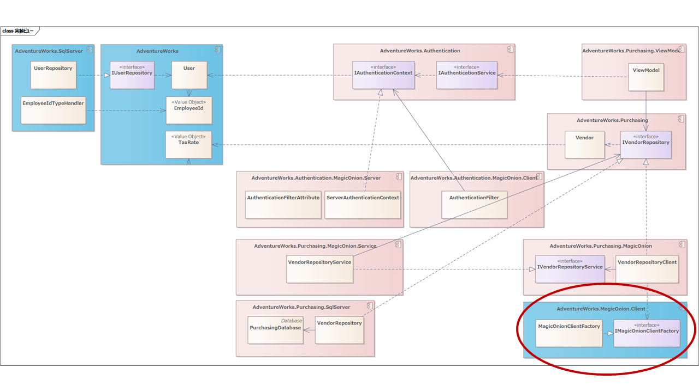

## 認証ドメインの実装ビュー設計

さてでは、先ほどのオブジェクトをコンポーネント単位に振り分けてみましょう。


こんな感じでしょうか？

認証ドメインのトップレベルのオブジェクトであるIAuthenticationServiceとIAuthenticationContextをAdventureWorks.Authenticationコンポーネント（つまりVisual Studioのプロジェクト）とします。

認証はJSON Web Token（JWT）で実現します。そのため署名・復元をおこなうUserSerializerをAdventureWorks.Authentication.Jwtコンコーネんとに配置します。

JWTのクライアント側の実装となるAuthenticationServiceとClientAuthenticationContextをAdventureWorks.Authentication.Jwt.Clientに、サーバー側実装となるAuthenticationControllerをAdventureWorks.Authentication.Jwt.Serverに配置します。

WPFのケースでも説明しましたが、ホスティングに関する実装はそれだけに分離したいため、ASP.NET CoreのエントリーポイントとなるProgramクラスはAdventureWorks.Authentication.Jwt.Hosting.Restプロジェクトに置きました。


論理ビューとの対比はこんな感じ。とくに抜け漏れはなさそうです。

つづいて、リモートのビジネスロジックを呼び出して検証する側を見ていきましょう。


検証側はMagicOnionを利用したgRPC呼び出しになります。

gRPCでJWTを利用するために、クライアント側でトークンをHTTPヘッダーに登録するAuthenticationFilterは、AdventureWorks.Authentication.MagicOnion.Clientに配置しました。

同様にサーバーサードで検証を行うAuthenticationFilterAttributeは、AdventureWorks.Authentication.MagicOnion.Serverに配置しました。

検証時のシーケンスはこんな感じで、UserSerializerは1つだけ配置したので少しレイアウトが違いますが、だいたい同じようになりました。

もう一度全体を眺めてみましょう。


依存関係に循環もなく、コンポーネント間も基本的にインターフェイスベースの結合となっていて、悪くなさそうです。

では本当に問題ないか、仮実装しながら設計を検証していきましょう。

### 認証処理の実装による検証

まずはアプリケーション起動直後の認証処理です。MainWindowのViewModelに認証処理を組み込んで、認証が通ればメニューを表示するように実装します。

そのため、IAuthenticationServiceと画面遷移を提供するIPresentationServiceをDIコンテナーから注入します。

```cs
private readonly IAuthenticationService _authenticationService;
private readonly IPresentationService _presentationService;

public MainViewModel(
    [Inject] IAuthenticationService authenticationService,
    [Inject] IPresentationService presentationService)
{
    _authenticationService = authenticationService;
    _presentationService = presentationService;
}
```

KamishibaiではViewModelにDIコンテナーから注入したいオブジェクトにはInject属性を宣言する仕様となっています。

Kamishibaiでは型安全かつNullableを最大限活用して画面遷移パラメーターを渡せるように、コンストラクターで受け取れるようになっています。その際に、画面遷移パラメーターと、DIコンテナーから注入するオブジェクトを区別するために、注入する側にInject属性を付与する仕様になっています。

とはいえここでは、Kamishibaiのお作法は「だいたいこんなものかな」という理解で問題ありません。

その上で、MainWindowの画面遷移完了後に認証処理を呼び出します。

```cs
public class MainViewModel : INavigatedAsyncAware
{
    ・・・

    public async Task OnNavigatedAsync(PostForwardEventArgs args)
    {
        var result = await _authenticationService.TryAuthenticateAsync();
        if (result.IsAuthenticated)
        {
            await _presentationService.NavigateToMenuAsync();
        }
        else
        {
            _presentationService.ShowMessage(
                Purchasing.ViewModel.Properties.Resources.AuthenticationFailed,
                Purchasing.ViewModel.Properties.Resources.AuthenticationFailedCaption,
                MessageBoxButton.OK,
                MessageBoxImage.Error);
            // アプリケーションを終了する。
            Environment.Exit(1);
        }
    }
}
```

Kamishibaiでは画面遷移後に処理を行いたい場合、INavigatedAsyncAwareを実装し、OnNavigatedAsyncで通知をうけます。

コンストラクターから注入したIAuthenticationServiceのTryAuthenticateAsyncを呼び出してユーザーを認証し、認証エラーとなった場合、アラートを表示してアプリケーションを終了します。

ViewModel上の処理は問題なさそうです。

ではTryAuthenticateAsyncの実装を確認しましょう。

```cs
// Windows認証を有効化したHTTPクライアント
private static readonly HttpClient HttpClient = new(new HttpClientHandler { UseDefaultCredentials = true });
private readonly ClientAuthenticationContext _context;  // DIコンテナーから注入する
private readonly Audience _audience;                    // DIコンテナーから注入する

public async Task<AuthenticateResult> TryAuthenticateAsync()
{
    try
    {
        // 環境変数からAPIのエンドポイントを取得する。
        var baseAddress = Environments.GetEnvironmentVariable(
            "AdventureWorks.Authentication.Jwt.Rest.BaseAddress",
            "https://localhost:4001");
        // 認証処理を呼び出す。
        var token = await HttpClient.GetStringAsync($"{baseAddress}/Authentication/{_audience.Value}");
        // トークンを受け取って複合し、結果をAuthenticationContextへ設定する。
        _context.CurrentTokenString = token;
        _context.CurrentUser = UserSerializer.Deserialize(token, _audience);
        return new(true, Context);
    }
    catch
    {
        return new(false, Context);
    }
}
```

APIのベースアドレス（https://foo.co.jp など）は、実運用や各種テスト環境、実装環境すべてで異なります。その問題を解決する何らかの方法が必要で、個人的には環境変数を好んでいます。設定ファイルに記述した場合、ビルドしたモジュールに含まれる設定ファイルを環境別に書き換える必要があるため、トラブルになりがちだからです。

"AdventureWorks.Authentication.Jwt.Rest.BaseAddress"が環境変数の名称になります。環境変数名と一緒にデフォルト値を渡しています。開発時は、クローンしてビルドしただけで、そのまま実行できることが好ましいです。そのため、開発環境は環境変数がない前提でデフォルト値を渡しています。

認証APIには引数としてAudienceを渡しています。JWTのaudience（audクレーム）は、トークンの受信者を特定するために使用されるます。購買ドメインでは、購買APIサービスを呼び出します。この購買APIサービスがトークンの受信者になります。そのため認証時に購買APIサービスのAudienceを渡します。

認証が正しくおこなれたら、DIコンテナーから注入されたClientAuthenticationContextにユーザー情報を反映します。ClientAuthenticationContextはシングルトンにして、認証情報を必要とする箇所でシングルトンインスタンスを注入して利用します。

ではサーバー側のコードを確認してみましょう。

```cs
private readonly IUserRepository _userRepository;

[HttpGet("{audience}")]
public async Task<string> AuthenticateAsync(string audience)
{
    var account = User.Identity!.Name!;
    var user = await _userRepository.GetUserAsync(new LoginId(account));
```

ASP.NET Coreでは、Windows認証を有効にしておくと「User.Identity!.Name!」から、簡単に呼び出し元のWindowsアカウントを特定できます。

アカウントを取得したら、IUserRepositoryインターフェイル経由でUserRepositoryを呼び出してUserオブジェクトを取得することでユーザーを認証します。

IUserRepositoryの実装クラス、UserRepositoryの実装を見てみましょう。

```cs
    public async Task<User?> GetUserAsync(LoginId loginId)
    {
        using var connection = _database.Open();

        const string query = @"
select
	EmployeeId
from
	AdventureWorks.vUser
where
	LoginId = @LoginId
";
        return await connection.QuerySingleOrDefaultAsync<User>(
            query,
            new
            {
                LoginId = loginId
            });
    }
```

一般的なDapperの実装です。定数定義されたクエリーを実行し、実行結果をDapperを利用して自動的にUserオブジェクトに値を設定します。

もう少し深堀して見てみましょう。Userクラスの中身を見てみましょう。

```cs
public record User(EmployeeId EmployeeId);

[UnitOf(typeof(int))]
public partial struct EmployeeId{}
```

Userはrecord型のオブジェクトで、ドメイン駆動型設計のエンティティに該当します。

UserはメンバーにEmployeeIdを持っています。EmployeeIdは構造体で、ドメイン駆動設計のバリューオブジェクトに該当します。

EmployeeIdはint型で扱うこともできるのですが、IDの取り違いはありがちな不具合を発生しがちです。

つぎのコードはEmployeeIdとProductIdをintであつかった時のサンプルコードです。

```cs
public record ProductOrder(int ProductId, int EmployeeId);

public void Order(int employeeId, int productId)
{
    var productOrder = new ProductOrder(employeeId, productId);
```

ProductOrderにProductIdとEmployeeIdを渡していますが、順序が逆になってしまっています。そしてこのコードはコンパイルが通ってしまします。

もちろん適切なコードがあれば、いずれかのタイミングで気が付きます。しかしデータベースから値を取得したときに、テストデータの初期値はどちらも1だったりすると、気が付くのが遅くなってしまうこともままあります。

ではIDをバリューオブジェクトとして扱った場合はどうなるでしょうか？

```cs
public record ProductOrder(ProductId ProductId, EmployeeId EmployeeId);

public void Order(EmployeeId employeeId, ProductId productId)
{
    var productOrder = new ProductOrder(employeeId, productId);
}
```

このコードはコンパイルエラーになるので、実装時に即座にエラーに気が付きますし、そもそもIDEが適切なコードをアシストしてくれるかもしれません。

私は、開発上で最初のテストはコンパイルであると思っています。コンパイルはもっともはやく、かならず実行され、そしてテストを間違いません。そのため実装スタイルと一番重要な鉄則の1つに

「不具合をコンパイラーが捕捉できるコードを優先する」

があると思っていて、IDをバリューオブジェクトとして扱うことは、ベストプラクティスの1つだと思っています。

さてEmployeeIdをもう一度見てみましょう。

```cs
[UnitOf(typeof(int))]
public partial struct EmployeeId{}
```

UnitOf属性が付与されていることが見て取れますが、バリューオブジェクトの実装には[UnitGeneratorライブラリ](https://github.com/Cysharp/UnitGenerator)を利用します。

IDはもっとも単純なバリューオブジェクトですが、金額や重量のような計算をともなう場合は、実装が複雑になりがちです。UnitGeneratorは非常によく考えられたライブラリで、ドメイン駆動設計を強力にサポートしてくれるのでオススメです。

さて、実は下記のDapperを利用したコードはこのままでは動作しません。

```cs
return await connection.QuerySingleOrDefaultAsync<User>(
    query,
    new
    {
        LoginId = loginId
    });
```

EmployeeIdをDapperが解釈できないからです。そのため、つぎのようなTypeHandlerを用意してあげる必要があります。

```cs
public class EmployeeIdTypeHandler : SqlMapper.TypeHandler<EmployeeId>
{
    public override void SetValue(IDbDataParameter parameter, EmployeeId value)
    {
        parameter.DbType = DbType.Int32;
        parameter.Value = value.AsPrimitive();
    }

    public override EmployeeId Parse(object value)
    {
        return new EmployeeId((System.Int32)value);
    }
}
```

UnitGeneratorにはこのTypeHandlerをつぎのように宣言するだけ実装できます。

```cs
[UnitOf(typeof(int), UnitGenerateOptions.DapperTypeHandler)]
public partial struct EmployeeId
{
}
```

よくできていますね。よくできているんですが、UnitGenerator側ではなくて、システム全体のアーキテクチャとしては少し問題があります。全体の構造を見てみましょう。


EmployeeIdはUserオブジェクトと同じようにAdventureWorksコンポーネントに配置されます。そのため、上記のように宣言的にTypeHandlerを実装しようとした場合、AdventureWorksがDapperに依存してしまいます。

もちろん、アーキテクチャ的な決断として、AdventureWorksがDapperに依存するのを受け入れるという手もあります。

ただ個人的にはあまり好みではありません。というのは、AdventureWorksがDapperに依存してしまった場合、Dapperのバージョンを上げないといけないとなったときに、ほぼすべてのドメインが影響を受けてしまうからです。Dapperのバージョンを気軽に上げるということが、かなわなくなります。

ではUnitGeneratorは良いのか？というと、受け入れられる範囲だと思っています。UnitGeneratorは、Valueオブジェクトを生成するライブラリという側面ではすでに完成されていて、なんならバージョンはほぼ永久的に固定することができそうです。またUnitGeneratorはValueオブジェクトのコードを自動生成しているだけなので、問題があれば手動での実装に切り替えても支障がありません。

そのため本稿ではそこは妥協せず、TypeHandlerを作成して、AdventureWorks.SqlServer側に配置することとしました。


AdventureWorksにEmployeeIdを、AdventureWorks.SqlServerにEmployeeIdTypeHandlerを配置しました。

EmployeeIdTypeHandlerの実装ですが、UnitGeneratorで宣言的に解決しないとなると、みずから実装しなくてはなりません。すべてのValueObjectに対して実装するのはそれなりに手間なので、コード生成形の手段で解決したいところです。

今回はT4 Templateを利用して、つぎのように解決することにしました。

```cs
<#
	var @namespace = "AdventureWorks.SqlServer";
	var types = new []
	{
		(UnitName: "EmployeeId", UnitType: typeof(int)),
        ・・・
	};
#>

<#@ include file="..\AdventureWorks.Database\DapperTypeHandlers.t4" once="true" #>
```

T4の詳細は割愛します。少し古い仕組みですが、C#でもっとも簡単に利用できるコード生成手段です。生成されたコードがバージョン管理できるところが、個人的には結構好きです。

さて、忘れないうちに購買ドメインの配置ビューも更新しておきましょう。



UnitGeneratorはサーバーサイド、クライアントサイドのどちらにも配置されます。

さぁ、これでDapperを利用してエンティティやバリューオブジェクトを直接利用できるようになりました。ということで、認証処理側に戻りましょう。

```cs
[HttpGet("{audience}")]
public async Task<string> AuthenticateAsync(string audience)
{
    var account = User.Identity!.Name!;
    var user = await _userRepository.GetUserAsync(new LoginId(account));
    if (user is null)
    {
        throw new AuthenticationException();
    }

    // ここで本来はuserとがaudienceを照らし合わせて検証する

    // 認証が成功した場合、ユーザーからJWTトークンを生成する。
    return UserSerializer.Serialize(user, Properties.Resources.PrivateKey, new Audience(audience));
}
```

IUnitRepositoryからUserを取得して、取得できなかった場合、ユーザーとして登録されていない為、認証エラーとします。

その後、何らかの形でuserとaudienceを照らし合わせて、audienceを利用できるか検証（認可）します。

ユーザーとオーディエンスの情報がそろうことで、ユーザーの特定だけでなく、そのユーザーが対象のオーディエンスを利用できるかどうか、認可することが可能になります。

ここで秘密鍵で署名することで、認証情報を持ったJSON Web Token（JWT）を作成します。

JWTには任意の情報を詰めることができますが、あまり情報を詰めすぎると、gRPCの呼出し時に通信量が増えてしまいます。今回はJWTには従業員IDだけ詰めることにしましたが、ロールのような権限情報を付与しても良いと思います。

さてこれで、サーバーサイドの処理が終わったのでクライアント側に戻ります。

```cs
public async Task<AuthenticateResult> TryAuthenticateAsync()
{
    try
    {
        var baseAddress = Environments.GetEnvironmentVariable(
            "AdventureWorks.Authentication.Jwt.Rest.BaseAddress",
            "https://localhost:4001");
        var token = await HttpClient.GetStringAsync($"{baseAddress}/Authentication/{_audience.Value}");
        _context.CurrentTokenString = token;
        _context.CurrentUser = UserSerializer.Deserialize(token, _audience);
        return new(true, _context);
    }
    catch
    {
        return new(false, _context);
    }
}
```

サーバーサイドでAuthenticationExceptionがスローされると、クライアント側でも例外が発生するので、キャッチして認証エラーとします。利用者が認証できないケースは、機能的なシナリオとして十分考えられることで、ここではランタイムエラーとはせずに、例外はキャッチして通常のロジック内で処理します。

正常に返却された場合、秘密鍵で証明されたトークンが返却されるので、トークンと、トークンから複合したUserオブジェクトを保持します。

トークンはgRPCの通信時に利用し、Userオブジェクトは必要に応じてアプリケーションで利用します。

これで認証全体の流れが実装できることが確認できました。

記事内では結構すんなり進んでいますが、記事を書くために実装している間は、だいぶモデルとコードを行ったり来たりして、何度も細かい設計変更を行っています。10箇所やそこらじゃないです。「そういうもの」だと思ってください。
