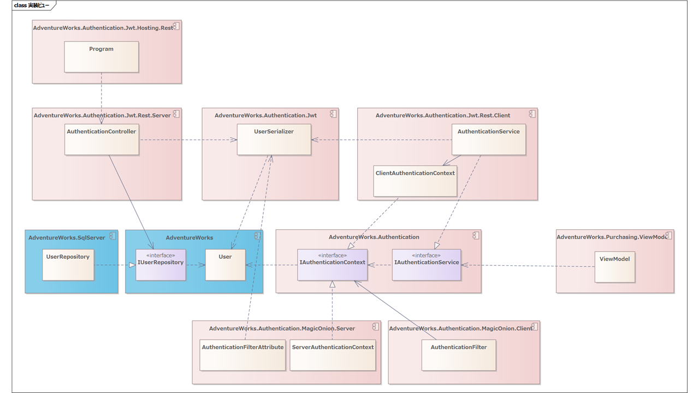
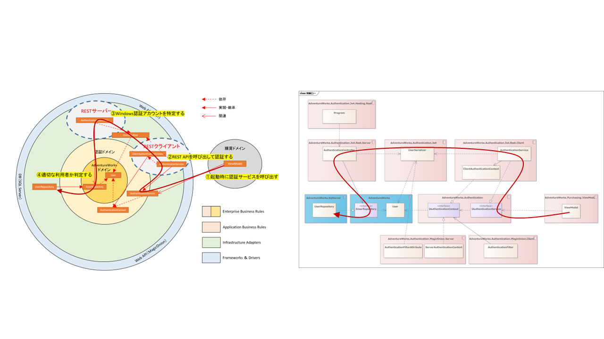
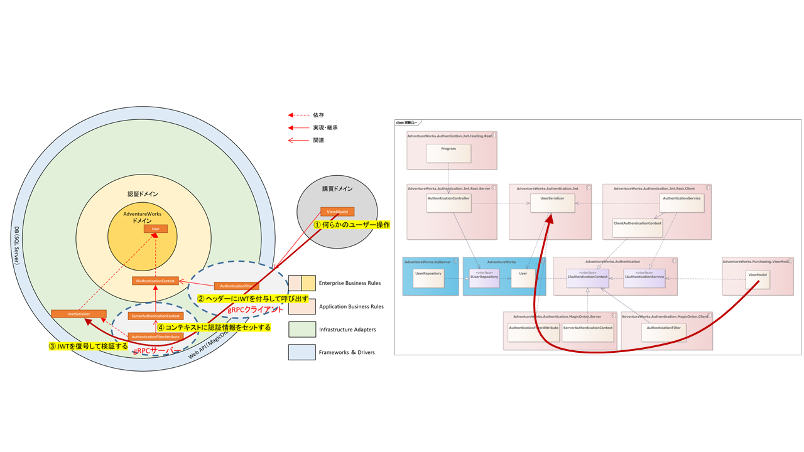

## 認証ドメインの実装ビュー設計

さてでは、先ほどのオブジェクトをパッケージ単位に振り分けてみましょう。



こんな感じでしょうか？

認証ドメインのトップレベルのオブジェクトであるIAuthenticationServiceとIAuthenticationContextをAdventureWorks.Authenticationコンポーネント（つまりVisual Studioのプロジェクト）とします。

認証はJSON Web Token（JWT）で実現します。そのため署名・復元をおこなうUserSerializerをAdventureWorks.Authentication.Jwtコンコーネんとに配置します。

JWTのクライアント側の実装となるAuthenticationServiceとClientAuthenticationContextをAdventureWorks.Authentication.Jwt.Clientに、サーバー側実装となるAuthenticationControllerをAdventureWorks.Authentication.Jwt.Serverに配置します。

WPFのときにも説明しましたが、ホスティングに関する実装はそれだけに分離したいため、ASP.NET CoreのエントリーポイントとなるProgramクラスはAdventureWorks.Authentication.Jwt.Hosting.Restプロジェクトに置きました。



論理ビューとの対比はこんな感じ。問題なさそうです。

では実際にリモートのビジネスロジックを呼び出して検証する側を見ていきましょう。

検証側はMagicOnionを利用したgRPC呼び出しになります。

gRPCでJWTを利用するために、クライアント側でトークンをHTTPヘッダーに登録するAuthenticationFilterは、AdventureWorks.Authentication.MagicOnion.Clientに配置しました。

同様にサーバーサードで検証を行うAuthenticationFilterAttributeは、AdventureWorks.Authentication.MagicOnion.Serverに配置しました。



検証時のシーケンスはこんな感じで、UserSerializerは1つだけ配置したので少しレイアウトが違いますが、だいたい同じようになりました。

もう一度全体を眺めてみましょう。


依存関係に循環もなく、コンポーネント間も基本的にインターフェイスベースの結合となっていて、悪くなさそうです。

では本当に問題ないか、仮実装しながら設計を検証していきましょう。

### 認証処理の実装による検証

まずはアプリケーション起動直後の認証処理です。MainWindowのViewModelに認証処理を組み込んで、認証が通ればメニューを表示するように実装します。

そのため、IAuthenticationServiceと画面遷移を提供するIPresentationServiceをDIコンテナーから注入します。

```cs
private readonly IAuthenticationService _authenticationService;
private readonly Menu.ViewModel.IPresentationService _presentationService;

public MainViewModel(
    [Inject] IAuthenticationService authenticationService,
    [Inject] Menu.ViewModel.IPresentationService presentationService)
{
    _authenticationService = authenticationService;
    _presentationService = presentationService;
}
```

KamishibaiではViewModelにDIコンテナーから注入したいオブジェクトにはInjectAttributeを宣言する仕様となっています。

Kamishibaiでは型安全かつNullableを最大限活用して画面遷移パラメーターを渡せるように、コンストラクターで受け取れるようになっています。その際に、画面遷移パラメーターと、DIコンテナーから注入するオブジェクトを区別するために、注入する側にInjectAttributeを付与する仕様になっています。

その上で、MainWindowの画面遷移完了後に認証処理を呼び出します。

```cs
public class MainViewModel : INavigatedAsyncAware
{
    ・・・

    public async Task OnNavigatedAsync(PostForwardEventArgs args)
    {
        var result = await _authenticationService.TryAuthenticateAsync();
        if (result.IsAuthenticated)
        {
            await _presentationService.NavigateToMenuAsync();
        }
        else
        {
            _presentationService.ShowMessage(
                "ユーザー認証に失敗しました。",
                "認証エラー",
                MessageBoxButton.OK,
                MessageBoxImage.Error);
            // アプリケーションを終了する。
            Environment.Exit(1);
        }
    }
}
```

Kamishibaiでは画面遷移後に処理を行いたい場合、INavigatedAsyncAwareを実装します。

コンストラクターから注入したIAuthenticationServiceのTryAuthenticateAsyncを呼び出してユーザーを認証し、認証エラーとなった場合、アラートを表示してアプリケーションを終了します。

ViewModel上の処理は問題なさそうです。

ではTryAuthenticateAsyncの実装を確認しましょう。

```cs
// Windows認証を有効化したHTTPクライアント
private static readonly HttpClient HttpClient = new(new HttpClientHandler { UseDefaultCredentials = true });
private readonly ClientAuthenticationContext _context;  // DIコンテナーから注入する
private readonly Audience _audience;                    // DIコンテナーから注入する

public async Task<AuthenticateResult> TryAuthenticateAsync()
{
    try
    {
        var baseAddress = Environments.GetEnvironmentVariable(
            "AdventureWorks.Authentication.Jwt.Rest.BaseAddress",
            "https://localhost:4001");
        var token = await HttpClient.GetStringAsync($"{baseAddress}/Authentication/{_audience.Value}");
        _context.CurrentTokenString = token;
        _context.CurrentUser = UserSerializer.Deserialize(token, _audience);
        return new(true, Context);
    }
    catch
    {
        return new(false, Context);
    }
}
```

APIのベースアドレス（https://foo.co.jpなど）は、実運用や各種テスト環境、実装環境すべてで異なります。その問題を解決する何らかの方法が必要です。個人的には環境変数を好んでいます。設定ファイルに記述する方法もありますが、その場合、ビルドしたモジュールに含まれる設定ファイルを環境別に書き換える必要があって、トラブルになりがちです。そこで環境依存の値を環境変数から取得することで、その問題を避ける方法をよく利用します。

"AdventureWorks.Authentication.Jwt.Rest.BaseAddress"が環境変数の名称になります。環境変数名と一緒にデフォルト値を渡しています。開発環境は、すべてがローカルにあることを想定しています。クローンしてビルドしたら、可能な限りそのまま実行できることが好ましいため、開発環境は環境変数がない前提でデフォルト値を渡しています。

認証APIには引数としてAudienceを渡しています。JWTのaudience（audクレーム）は、トークンの受信者を特定するために使用されるます。購買ドメインでは、購買APIサービスを呼び出します。この購買APIサービスがトークンの受信者になります。そのため認証時に購買APIサービスのAudienceを渡します。

認証が正しくおこなれたら、DIコンテナーから注入されたClientAuthenticationContextにユーザー情報を反映します。ClientAuthenticationContextはシングルトンにして、認証情報を必要とする箇所でシングルトンインスタンスを注入して利用します。

ではサーバー側のコードを確認してみましょう。

```cs
private readonly IUserRepository _userRepository;

[HttpGet("{audience}")]
public async Task<string> AuthenticateAsync(string audience)
{
    var account = User.Identity!.Name!;
    if (await _userRepository.TryGetUserByIdAsync(new LoginId(account), out var user))
    {
        // ここで本来はuserとがaudienceを照らし合わせて検証する

        // 認証が成功した場合、ユーザーからJWTトークンを生成する。
        return UserSerializer.Serialize(user, Properties.Resources.PrivateKey, new Audience(audience));
    }

    throw new AuthenticationException();
}
```

ASP.NET Coreでは、Windows認証を有効にしておくと「User.Identity!.Name!」から、簡単に呼び出し元のWindowsアカウントを特定できます。

アカウントを取得したら、IUserRepositoryインターフェイル経由でUserRepositoryを呼び出してUserオブジェクトを取得することでユーザーを認証します。

その後、何らかの形でuserとaudienceを照らし合わせて、audienceを利用できるか検証（認可）します。

ユーザーとオーディエンスの情報がそろうことで、ユーザーの特定だけでなく、そのユーザーが対象のオーディエンスを利用できるかどうか、認可することが可能になります。

ここで秘密鍵をもちいて署名することで、認証情報を持ったJSON Web Token（JWT）を作成します。

JWTには任意の情報を詰めることができますが、あまり情報を詰めすぎると、gRPCの呼出し時に通信量が増えてしまいます。今回はJWTには従業員IDだけ詰めることにしましたが、ロールのような権限情報を付与しても良いと思います。

### 検証処理の実装による検証

さて、続いてはアプリケーション操作時にgRPCを呼び出した際の検証処理です。


ユーザーが購買アプリケーションで何らかの操作をすると、ViewModelはgRPCのクライアント経由でサーバーサイドを呼び出します。

ちょっとこのままだと、具体的な実装が見えにくいので、前回の「設計編　全編」で購買ドメインのVendorオブジェクトをIVendorRepository経由で取得するオブジェクトを配置してみましょう。また手狭になってしまうので、認証側のオブジェクトをいったん削除したもでるがつぎの図です。


ユーザーが何らかの操作をしたとき、ViewModeにDIされたIVendorRepositoryを呼び出してVendorオブジェクトを取得します。

```cs
```

このとき実際には、IVendorRepositoryを実装したVendorRepository

この時、gRPCクライアントにAuthenticationFilterを適用してJWTトークンをHTTPヘッダーに付与します。

IAuthenticationContextはUserと、認証済のトークンを保持しています。

```cs
public interface IAuthenticationContext
{
    /// <summary>
    /// 認証済ユーザーを取得する。
    /// </summary>
    User CurrentUser { get; }

    /// <summary>
    /// 認証済みトークンを取得する。
    /// </summary>
    public string CurrentTokenString { get; }
}
```

gRPC呼び出し時に、HTTPヘッダーへ認証済みトークンを付与します。

```cs
public async ValueTask<ResponseContext> SendAsync(RequestContext context, Func<RequestContext, ValueTask<ResponseContext>> next)
{
    var header = context.CallOptions.Headers;
    header.Add("authorization", $"Bearer {_authenticationContext.CurrentTokenString}");

    return await next(context);
}
```

authorizationにBearer～の形式でトークンを設定するのは、OAuthの仕組みに則っています。

トークンはHTTPヘッダーに格納されて、メッセージとともにリモートへ送信します。

サーバーサイドでgRPCが呼び出された場合、リクエストをいったんすべてAuthenticationFilterAttributeで受け取り、トークンを検証します。

```cs
private readonly ServerAuthenticationContext _serverAuthenticationContext;

public override async ValueTask Invoke(ServiceContext context, Func<ServiceContext, ValueTask> next)
{
    try
    {
        var entry = context.CallContext.RequestHeaders.Get("authorization");
        var token = entry.Value.Substring("Bearer ".Length);
        _serverAuthenticationContext.CurrentUser = UserSerializer.Deserialize(token, _audience);
        _serverAuthenticationContext.CurrentTokenString = token;
    }
    catch (Exception e)
    {
        _logger.LogWarning(e, e.Message);
        context.CallContext.GetHttpContext().Response.StatusCode = StatusCodes.Status401Unauthorized;
        return;
    }

    try
    {
        await next(context);
    }
    finally
    {
        _serverAuthenticationContext.ClearCurrentUser();
    }
}
```

リクエストヘッダーのauthorizationからJWTを取得します。

取得したトークンをUserSerializer.Deserializeをつかって署名を検証しつつ複合し、ServerAuthenticationContextに設定することで、以後必要に応じて利用します。

サーバーサイドではIAuthenticationContextをDIすることで、インスタンスを使いまわす想定です。単純にプロパティに設定してしまうと、他者の権限で実行されてしまう可能性があります。そのため、サーバー用のIAuthenticationContextはつぎのように実装しています。

```cs
public class ServerAuthenticationContext : IAuthenticationContext
{
    private readonly AsyncLocal<User> _currentUserAsyncLocal = new();

    public User CurrentUser
    {
        get
        {
            if (_currentUserAsyncLocal.Value is null)
                throw new InvalidOperationException("認証処理の完了時に利用してください。");

            return _currentUserAsyncLocal.Value;
        }

        internal set => _currentUserAsyncLocal.Value = value;
    }
}
```

実体はAsyncLocal&lt;T>に保持します。これによって同一スレッド上ではかならず同じユーザーが取得できます。また設定はフィルターを通して行い、設定できた場合のみgRPCの実際の処理が実行されるます。

あとは必要な箇所でIAuthenticationContextをDIコンテナーから注入して利用します。

```cs
public class VendorRepositoryService : ServiceBase<IVendorRepositoryService>, IVendorRepositoryService
{
    private readonly IVendorRepository _repository;

    private readonly IAuthenticationContext _authenticationContext;

    public VendorRepositoryService(IVendorRepository repository, IAuthenticationContext authenticationContext)
    {
        _repository = repository;
        _authenticationContext = authenticationContext;
    }

    public async UnaryResult<Vendor> GetVendorByIdAsync(VendorId vendorId)
    {
        // 呼び出し元のユーザー情報を利用する。
        var user = _authenticationContext.CurrentUser;

        return await _repository.GetVendorByIdAsync(vendorId);
    }
}
```