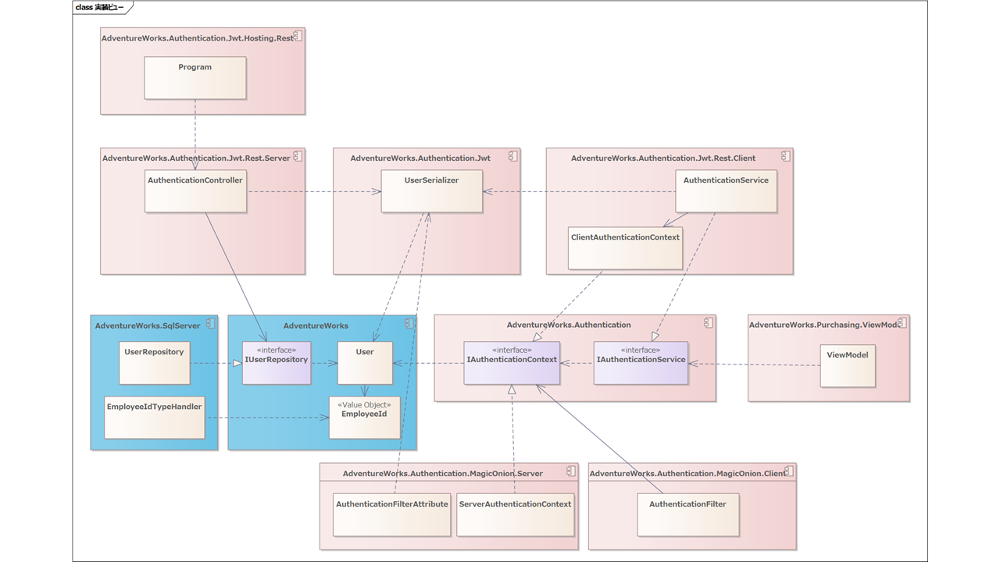
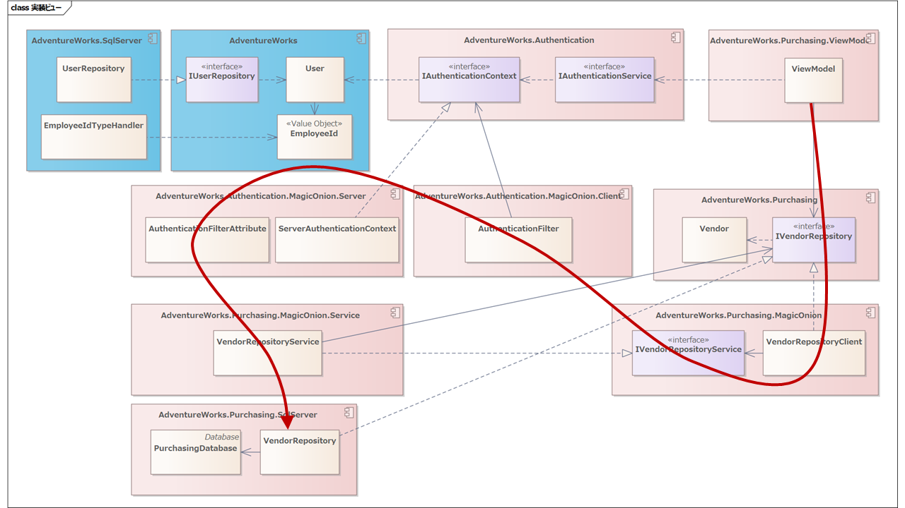
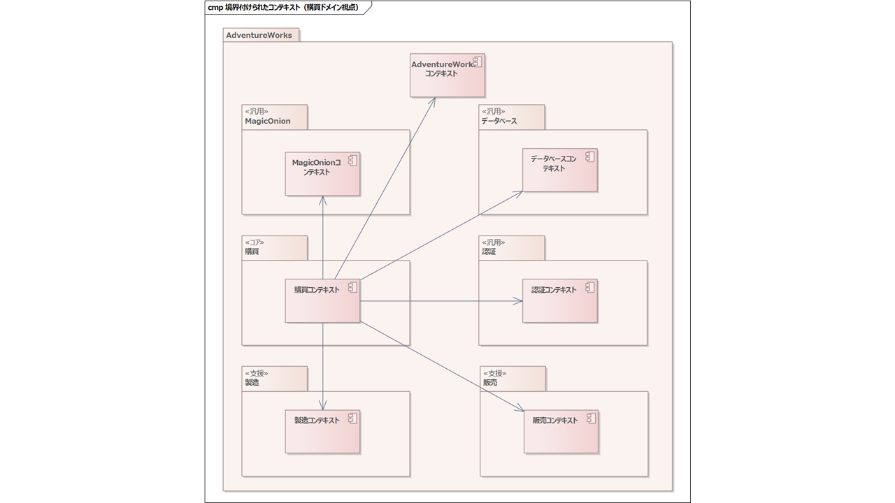
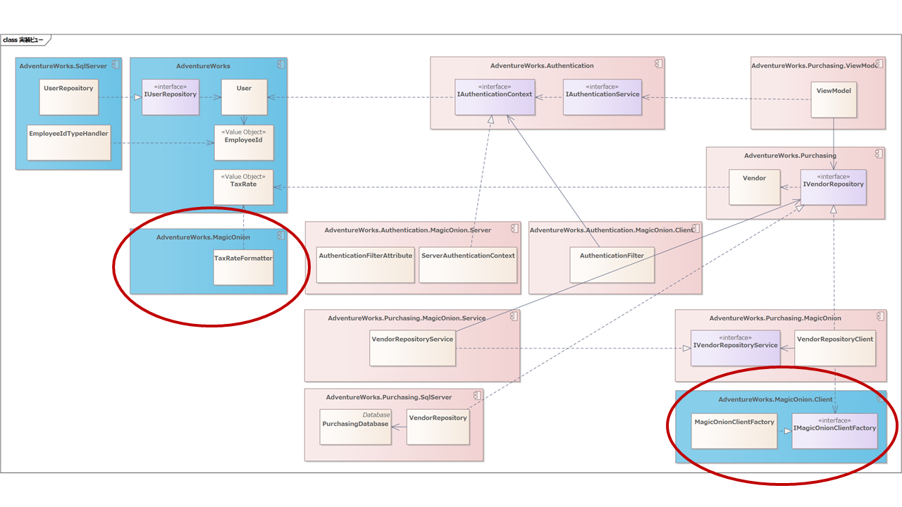
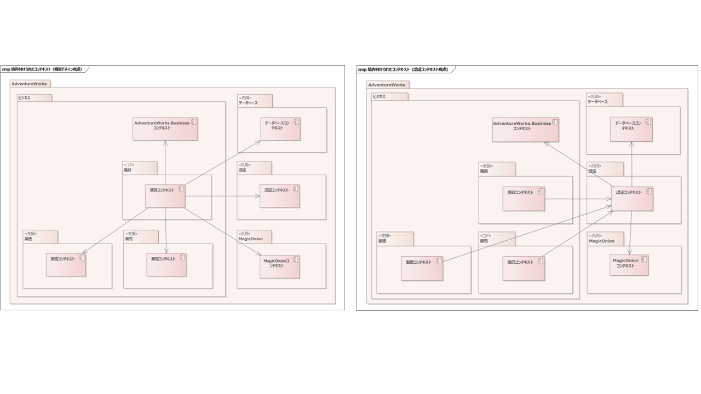
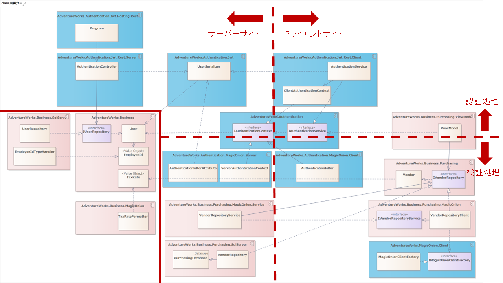

### 検証処理の実装による検証

さて、続いてはアプリケーション操作時にgRPCを呼び出した際の検証処理です。



ユーザーが購買アプリケーションで何らかの操作をすると、ViewModelはgRPCのクライアント経由でサーバーサイドを呼び出します。

ちょっとこのままだと、具体的な実装が見えにくいので、前回の「設計編　全編」で購買ドメインのVendorオブジェクトをIVendorRepository経由で取得するオブジェクトを配置してみましょう。また手狭になってしまうので、認証側のオブジェクトをいったん削除したもでるがつぎの図です。



ではViewModeから順番にコードを追って実装を確認していきましょう。

ユーザーが何らかの操作をしたとき、ViewModeにDIされたIVendorRepositoryを呼び出してVendorオブジェクトを取得します。

```cs
private readonly IVendorRepository _vendorRepository;

private async Task PurchaseAsync()
{
    var vendor = await _vendorRepository.GetVendorByIdAsync(_selectedRequiringPurchaseProduct!.VendorId);
```

このとき実際には、IVendorRepositoryを実装したVendorRepositoryClientが呼び出されます。

```cs
private IAuthenticationContext _authenticationContext;
private Endpoint _endpoint;

public async Task<Vendor> GetVendorByIdAsync(VendorId vendorId)
{
    var server = MagicOnionClient.Create<IVendorRepositoryService>(
        GrpcChannel.ForAddress(_endpoint.Uri),
        new IClientFilter[]
        {
            new AuthenticationFilter(_authenticationContext)
        });
    return await server.GetVendorByIdAsync(vendorId);
}
```

MagicOnionClientからIVendorRepositoryServiceのインスタンスを動的に生成して、サーバーサイドを呼び出します。Endpointは初出ですが、これは後ほど説明します。

IVendorRepositoryServiceを生成するときにAuthenticationFilterを適用します。

AuthenticationFilterではつぎのように、認証時に取得したトークンをHTTPヘッダーに付与します。

```cs
public async ValueTask<ResponseContext> SendAsync(RequestContext context, Func<RequestContext, ValueTask<ResponseContext>> next)
{
    var header = context.CallOptions.Headers;
    header.Add("authorization", $"Bearer {_authenticationContext.CurrentTokenString}");

    return await next(context);
}
```

authorizationにBearer～の形式でトークンを設定するのは、OAuthの仕組みに則っています。トークンはHTTPヘッダーに格納されて、メッセージとともにリモートへ送信します。

サーバーサイドでgRPCが呼び出された場合、リクエストをいったんすべてAuthenticationFilterAttributeで受け取り、トークンを検証します。

```cs
private readonly ServerAuthenticationContext _serverAuthenticationContext;

public override async ValueTask Invoke(ServiceContext context, Func<ServiceContext, ValueTask> next)
{
    try
    {
        var entry = context.CallContext.RequestHeaders.Get("authorization");
        var token = entry.Value.Substring("Bearer ".Length);
        _serverAuthenticationContext.CurrentUser = UserSerializer.Deserialize(token, _audience);
        _serverAuthenticationContext.CurrentTokenString = token;
    }
    catch (Exception e)
    {
        _logger.LogWarning(e, e.Message);
        context.CallContext.GetHttpContext().Response.StatusCode = StatusCodes.Status401Unauthorized;
        return;
    }

    try
    {
        await next(context);
    }
    finally
    {
        _serverAuthenticationContext.ClearCurrentUser();
    }
}
```

リクエストヘッダーのauthorizationからJWTを取得します。

取得したトークンをUserSerializer.Deserializeをつかって署名を検証しつつ複合し、ServerAuthenticationContextに設定することで、以後必要に応じて利用します。

トークンの複合に失敗した場合は、認証エラー（401エラー）を返します。

サーバーサイドではIAuthenticationContextをDIすることで、インスタンスを使いまわす想定です。単純にプロパティに設定してしまうと、他者の権限で実行されてしまう可能性があります。そのため、サーバー用のIAuthenticationContextはつぎのように実装しています。

```cs
public class ServerAuthenticationContext : IAuthenticationContext
{
    private readonly AsyncLocal<User> _currentUserAsyncLocal = new();

    public User CurrentUser
    {
        get
        {
            if (_currentUserAsyncLocal.Value is null)
                throw new InvalidOperationException("認証処理の完了時に利用してください。");

            return _currentUserAsyncLocal.Value;
        }

        internal set => _currentUserAsyncLocal.Value = value;
    }
}
```

実体はAsyncLocal&lt;T>に保持します。これによって同一スレッド上ではかならず同じユーザーが取得できます。また設定はフィルターを通して行い、設定できた場合のみgRPCの実際の処理が実行されるます。

あとは必要な箇所でIAuthenticationContextをDIコンテナーから注入して利用します。

```cs
public class VendorRepositoryService : ServiceBase<IVendorRepositoryService>, IVendorRepositoryService
{
    private readonly IVendorRepository _repository;

    private readonly IAuthenticationContext _authenticationContext;

    public VendorRepositoryService(IVendorRepository repository, IAuthenticationContext authenticationContext)
    {
        _repository = repository;
        _authenticationContext = authenticationContext;
    }

    public async UnaryResult<Vendor> GetVendorByIdAsync(VendorId vendorId)
    {
        // 呼び出し元のユーザー情報を利用する。
        var user = _authenticationContext.CurrentUser;

        return await _repository.GetVendorByIdAsync(vendorId);
    }
}
```

ところで、このコードは動きません。IUserRepositoryでDapperを利用するのにTypeHandlerを作成したようにValueオブジェクトのIMessagePackFormatterを作成する必要があります。

Vendorオブジェクトのコードを見てみましょう。

```cs
public record Vendor(VendorId VendorId, 
    AccountNumber AccountNumber, 
    string Name, 
    CreditRating CreditRating, 
    bool IsPreferredVendor, 
    bool IsActive, 
    Uri? PurchasingWebServiceUrl, 
    TaxRate TaxRate, 
    ModifiedDateTime ModifiedDateTime, 
    IReadOnlyList<VendorProduct> VendorProducts);
```

多数のValueオブジェクトが含まれています。TaxRateを見てみると値がdecimalの構造体であることが見て取れます。

```cs
namespace AdventureWorks;

[UnitOf(typeof(decimal))]
public partial struct TaxRate
{
}
```

TaxRateは全ドメインで共通して利用するため、AdventureWorksプロジェクトに含めます。

このような値をMagicOnionで送受信するためには、TaxRate用のIMessagePackFormatterを作成する必要があります。Dapperのときと同じように、UnitGeneratorでは属性指定することで生成ができます。

```cs
[UnitOf(typeof(decimal), UnitGenerateOptions.MessagePackFormatter)]
public partial struct TaxRate
{
}
```

ただ同様にこうしてしまうと、ドメインのコードがMagicOnion（正確にはそのシリアライザーであるMessagePack）に依存してしまい、ドメインのフレームワーク非依存が破壊されてしまいます。

Dapperのときと同様に、アーキテクチャ的に受け入れるという選択肢もあります。ただ、おなじくあまり好みではないため、プロジェクトは分けることにします。

AdventureWorks.TaxRateのMagicOnion用のIMessagePackFormatterなので、プロジェクトとしてはAdventureWorks.MagicOnionに含めましょう。

```cs
namespace AdventureWorks.MagicOnion;

public class TaxRateFormatter : IMessagePackFormatter<TaxRate>
{
    public void Serialize(ref MessagePackWriter writer, TaxRate value, MessagePackSerializerOptions options)
    {
        options.Resolver.GetFormatterWithVerify<System.Decimal>().Serialize(ref writer, value.AsPrimitive(), options);
    }

    public TaxRate Deserialize(ref MessagePackReader reader, MessagePackSerializerOptions options)
    {
        return new TaxRate(options.Resolver.GetFormatterWithVerify<System.Decimal>().Deserialize(ref reader, options));
    }
}
```

こんな感じのコードになります。やはり個別に実装するのは手間ですし、不具合も怖いのでT4なりなにかで自動生成するのがオススメです。

では忘れないうちに、TaxRateFormatterを実装ビューに反映しましょう。


VendorRepositoryの実装は、認証設計の際に説明したものと変わらない為、割愛します。

これでひととおり見たのですが、ひとつ気になるところがありました。IVendorRepositoryのクライアント側実装であるVendorRepositoryClientです。

```cs
private IAuthenticationContext _authenticationContext;
private Endpoint _endpoint;

public async Task<Vendor> GetVendorByIdAsync(VendorId vendorId)
{
    var server = MagicOnionClient.Create<IVendorRepositoryService>(
        GrpcChannel.ForAddress(_endpoint.Uri),
        new IClientFilter[]
        {
            new AuthenticationFilter(_authenticationContext)
        });
    return await server.GetVendorByIdAsync(vendorId);
}
```

問題はこの、MagicOnionClientからリモートのgRPCサーバーを呼び出す、gRPCクライアントの生成コードで毎回これを実装するには問題があります。

1. 適用するフィルターが変わったときに、クライアント呼び出しコードをすべて修正しないといけない
2. エンドポイントも個別に指定したくない
3. 単純にコードが多い

とうわけで、ファクトリーを作成して、これらを隠蔽しましょう。

```cs
public interface IMagicOnionClientFactory
{
    T Create<T>() where T : IService<T>;
}

public class MagicOnionClientFactory : IMagicOnionClientFactory
{
    private readonly IAuthenticationContext _authenticationContext;
    private readonly Endpoint _endpoint;

    public MagicOnionClientFactory(
        IAuthenticationContext authenticationContext,
        Endpoint endpoint)
    {
        _authenticationContext = authenticationContext;
        _endpoint = endpoint;
    }

    public T Create<T>() where T : IService<T>
    {
        return MagicOnionClient.Create<T>(
            GrpcChannel.ForAddress(_endpoint.Uri),
            new IClientFilter[]
            {
                new AuthenticationFilter(_authenticationContext)
            });
    }
}
```

こんな感じでファクトリー側にコードを押し出して、利用する場所ではつぎのように使います。

```cs
private readonly IMagicOnionClientFactory _clientFactory;
public async Task<Vendor> GetVendorByIdAsync(VendorId vendorId)
{
    var server = _clientFactory.Create<IVendorRepositoryService>();
    return await server.GetVendorByIdAsync(vendorId);
}
```

ではこれを実装ビューに反映しましょう。


AdventureWorks全体で利用するMagicOnion用の、クライアント限定オブジェクトなので、AdventureWorks.MagicOnion.Clientプロジェクトに置くことにしました。

これは認証やデータベースと同列のものなので、ドメインモデルにも反映する必要がるでしょう。ということで、反映したのが下図になります。


認証ドメイン視点がこちら。そして



購買ドメイン視点だとこちらになります。さて、気が付いた方はいらっしゃるでしょうか？普通に読んでいるとほとんどの方は気が付かないと思うのですが、ここにきて重大な設計ミスが発覚しました。



ここの2つのネーミングがプロジェクトの命名規則を違反しています。

- AdventureWorks.MagicOnion
- AdventureWorks.MagicOnion.Client

プロジェクトの親子関係は、子は親を具体化したもので、親は子の抽象となるように設計すると初期で宣言しました。

ところが、AdventureWorks.MagicOnionはAdventureWorksのMagicOnion実装で、AdventureWorksドメイン固有のものです。

それに対してAdventureWorks.MagicOnion.Clientは全ドメインから汎用ドメインとして利用される、MagicOnionのクライアントサポートライブラリです。

名前空間的に子であるAdventureWorks.MagicOnion.Clientのほうが、概念的にはスコープが広い状態になってしまっていて、ここだけ名前空間の設計が破綻しています。

ではどうするか？

結局、ビジネス的なツリー構造と、技術的なツリー構造が混ぜてしまったことが原因でしょう。ということで、そこを分離する必要があります。

とうことで、ビジネス関連のドメインをAdventureWorks.Businessとして、ビジネスの実現をサポートする汎用ドメインは、「AdventureWorks .汎用ドメイン名」という形に修正しましょう。

今回の最大のインパクトある設計ミスです。AdventureWorksドメインもそうですが、購買・販売・製造ドメインの名前空間をすべて変更しなくてはなりません。実際のところ、ゼロからアーキテクチャ設計していると、こういったどんでん返しはそれなりに発生します。

ではまず、境界付けられたコンテキストを修正します。



つぎのようなツリー構造になります。

- AdventureWorks
   - ビジネス
      - 購買
      - 販売
      - 製造
   - データベース
   - 認証
   - MagicOnion

ビジネスを挟んだことで、逆にすっきりしたように感じます。

コンテキストマップは変わらないので、つぎは実装ビューを見てみましょう。



ベージュ色の部分がビジネス関連のプロジェクトです。

ここまで来れば明らかなんですが、ビジネスドメインのルートをAdventureWorksにしてしまうと、非ビジネスのドメインと命名がコンフリクトする可能性は排除できません。そのためトップをプロダクト名前空間にして、その下はビジネスのルートと、非ビジネスを並べる形が無難です。

さて、認証ドメインについてはいったんこのあたりにしましょう。まだ何かある可能性はありますが、認証ドメインだけみていても、コスパは悪そうです。他の要件を設計しながら、認証ドメインの設計に問題がないか検証していきましょう。


