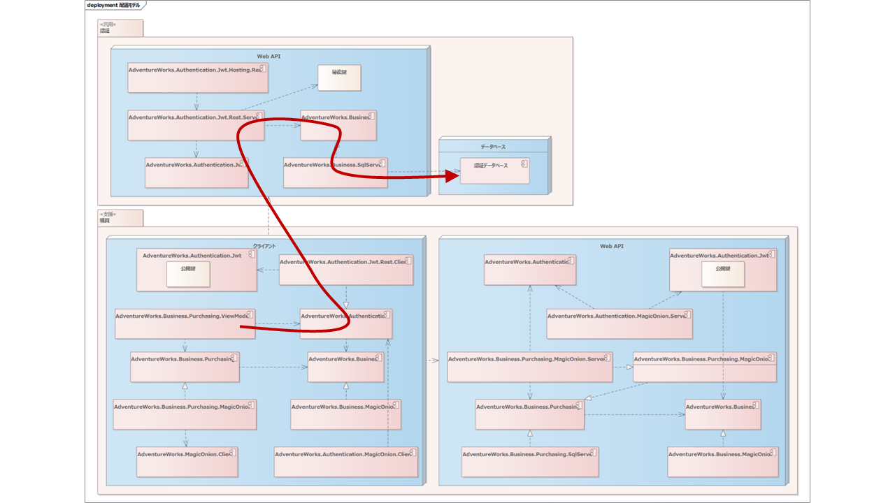

## 認証ドメインの配置ビュー

先ほど、認証ドメインの実装ビューを作成しました。つづいて、そこで設計されたコンポーネントを論理ノードに配置しましょう。

これだけだと分かりにくいので、認証と検証にわけて流れを追いつつ見てみましょう。

### 認証処理の確認

認証時の大まかな流れはつぎの通り。

アプリケーションの起動時にViewModelから、AdventureWorks.Authenticationコンポーネント（名前空間をすべて書くと長すぎるので、以後省略しつつ記載します。）のIAuthenticationServiceを経由して認証処理を呼び出します。IAuthenticationServiceの実装クラスであるAuthenticationServiceの含まれる～.Jwt.Rest.Clientコンポーネントをとおしてサーバーサイドを呼び出します。

サーバーサイドのリクエストは～.Jwt.Rest.ServerコンポーネントのAuthenticationControllerにRESTのリクエストが呼び出されます。AuthenticationControllerはWindows認証を利用してリモートのアカウントを取得し、AdventureWorks.BusinessコンポーネントのIUserRepositoryを利用して、データベースからUserを取得して認証処理を行います。このとき実体は～.Business.SqlServerコンポーネントのUserRepositoryが利用されます。

正しくUserが取得できたら、～.JwtコンポーネントのUserSerializerを利用してJWTトークンを作成して返却します。

～.Hosting.RestはサーバーサイドのWeb APIをホスティングするための全体を統括するコンポーネントです。

おおむねこんな流れですが、問題はなさそうです。

### 検証処理の確認

つづいて検証時の流れです。

ユーザー操作に応じてViewModelから～.PurchasingコンポーネントのIVendorRepositoryをとおしてVenderオブジェクトを取得します。IVendorRepositoryの実体はリモートのWeb API側にあります。そのため、IVendorRepositoryのgRPCクライアントである～Purchasing.MagicOnionコンポーネントのVendorRepositoryClientが呼び出されます。

その際、認証情報であるJWTを～.Authentication.MagicOnion.ClientコンポーネントのAuthenticationFilterで付与してからサーバーサイドが呼び出されます。

サーバーサイドでは～.Authentication.MagicOnion.ServerコンポーネントのAuthenticationFilterAttributeで、HTTPヘッダーからJWTを取得して検証します。

問題なければ～.Purchasing.MagicOnion.ServerコンポーネントのVendorRepositoryServiceが呼び出されます。VendorRepositoryServiceは～.Purchasing.SqlServerコンポーネントのVendorRepositoryクラスを利用してVendorオブジェクトを取得してクライアント側に返却します。

このときVendorオブジェクトに含まれるTaxRateのようなValueオブジェクトのgRPC上のシリアライズ・デシリアライズに～.Business.MagicOnionのFormatterが利用されます。

検証側もどうやら問題なさそうです。

さて、認証ドメインについてはいったんこのあたりにしましょう。まだ何かある可能性はありますが、認証ドメインだけみていても、コスパは悪そうです。他の要件を設計しながら、認証ドメインの設計に問題がないか検証していきましょう。