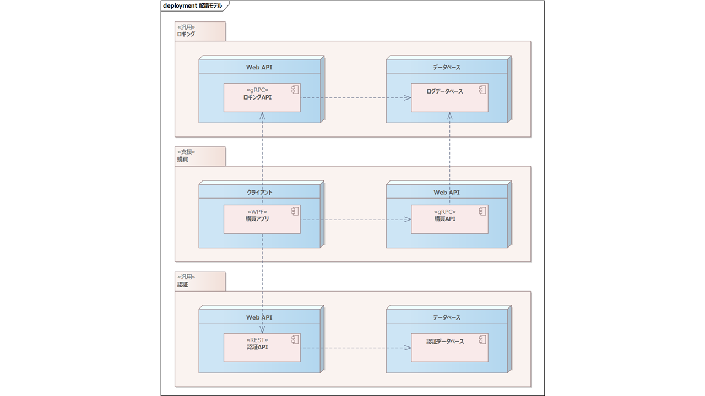
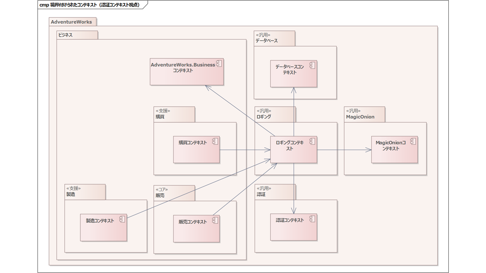
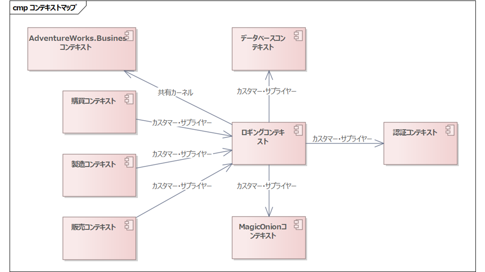
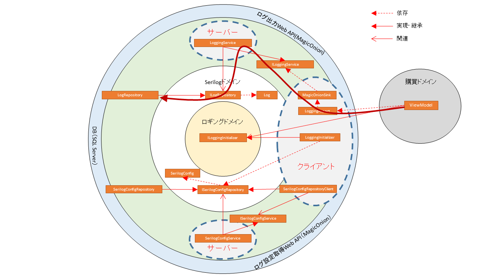

# ロギングアーキテクチャ

ここからはロギングアーキテクチャについて設計していきましょう。

まずはロギングの要件を明確にします。

## ロギング要件

今回は仮に、つぎのような要件があるものとします。

1. ログは可能な限り一貫して保管するため、基本的にはサーバーサイドに保管すること
2. ただしロギングサーバーが停止している場合も考慮し、エラーレベルのログはローカルファイルシステムにもあわせて保管すること
3. ログは将来的な分析に利用するため、構造化ログを利用すること
4. ログの出力には、ログ出力を要求した端末・ユーザーの情報を含めること
5. ログの出力レベルは、モジュールの再配布なく、サーバーサイドから変更可能であること

WPFアプリケーションの場合、要件5が実現できると、運用時に楽になることがあります。WPFアプリケーションの場合、Webアプリケーションとちがって再配布が容易ではないため、障害などの解析が必要になった際に、ログの出力レベルを再配布なく変更できことは、おおきなメリットとなります。

なお要件4に一部のログ属性について言及していますが、今回はこれ以外の属性については言及しません。とくにユーザー情報に関しては、認証処理と密接にかかわってくるため入れましたが、それ以外は実際のプロジェクトにおいて必要に応じて検討してください。

## ログ出力レベル設計

さて詳細な設計に入り前に、ログの出力レベルについて決定しておきましょう。ここからは仮の実装を行いながら設計します。出力レベルの認識がずれていると、あとから直すのは負担が大きいためです。

|レベル|通常時出力|クライアントサイド|サーバーサイド|
|--|:-:|--|--|
|Trace|×|Debugレベル以外のViewModelのメソッド呼び出し時|なし|
|Debug|×|ViewModelの画面遷移イベント発生時、またはCommand呼び出し時|なし|
|Information|〇|なし|HTTPのリクエスト、レスポンス時。認証後のAPI呼び出し前。|
|Warning|〇|アプリケーションの機能に影響を与える可能性のあると判断したとき。個別に相談の上決定し、つど本表を更新する。|同左＋認証エラー時|
|Error|〇|意図しない例外の発生時|同左|
|Critical|〇|システムの運用に致命的な問題が発生した場合|同左|

通常はInformationレベル以上は出力し、Debug以下は、障害の調査時などに必要に応じて一時的に利用します。

上記仕様の場合、サーバーサイドで例外が発生した場合、クライアントサイドでもWeb API呼び出しが例外となります。そのため、同一の例外が2重で出力されますが、取りこぼすよりは良いため上記定義とします。

個人的にはWarningの扱いが難しいといつも感じます。単純明快なルールを定められたことがありません。良い提案があればぜひ伺いたいです。

### WPF上のTrace、Debugログ

前述のとおり、基本的にViewModelのメソッドの呼び出し箇所でログを仕込みます。ただ、これを抜け漏れ誤りなく実装するのは大変です。

そこで今回はPostSharpというAOPライブラリを利用して、一括でログ出力コードを「編み込み」ます。AOPとはAspect Oriented Programming、アスペクト志向プログラミングのことで、横断的な関心毎を「アスペクト」として、その関心を必要とする場所に「編み込む」方法論のことです。

詳細な説明はここでは割愛しますが、ここではログ出力処理をアスペクトとしてViewModelのメソッドに埋め込みます。

AOPライブラリは各種ありますが、おおきく2種類のタイプに分けられます。

1. プロキシーオブジェクトを作ってメソッド呼び出しをインターセプトするタイプ
2. コンパイル時にILを操作するなどして、特定のコードを任意の場所に埋め込むタイプ

PostSharpは2のタイプのライブラリです。

- [https://www.postsharp.net/](https://www.postsharp.net/)

10種類までのアスペクトであれば無償版でも利用でき、実績も多いため今回はPostSharpを利用します。

具体的には、つぎのようなOnMethodBoundaryAspectを継承したアスペクトを作成します。

```cs
public class LoggingAspect : OnMethodBoundaryAspect
{
    public static ILogger Logger・・・

    public override void OnEntry(MethodExecutionArgs args)
    {
        var logLevel = GetLogLevel(args);
        Logger.Log(logLevel, "{Type}.{Method}({Args}) Entry", args.Method.ReflectedType!.FullName, args.Method.Name, args);
```

そしてViewModelプロジェクトのAssemblyInfo.csなどに、つぎのように記載します。

```cs
using AdventureWorks.Wpf.ViewModel;

[assembly: LoggingAspect(AttributeTargetTypes = "*ViewModel")]
```

これでビルド時にViewModelのメソッドの入り口でLoggingAspectクラスのOnEntryが呼び出されるコードが編み込まれます。

非常に簡単ですし、抜け漏れ誤りなく実装が可能になります。

## ロギングアーキテクチャ概要

前述の要件を満たすために、ざっくりつぎのようなアーキテクチャを検討します。

1. ロギングのインターフェイスには、Microsoft.Extensions.Loggingを利用する
2. ロギングの実装には、Serilogを利用する（要件3）
3. ログの出力はSQL Server上に保管する（要件1）
4. WPFのログ出力は、SerilogのSink（出力先を拡張する仕組み）を利用してgRPCでサーバーへ送信して保管する（要件1）
5. またあわせてエラーレベルのログは、FileSinkを利用してローカルにも出よくする（要件2）
6. WPF・Web APIともに、起動時にログ設定ファイルをサーバーより取得して適用する（要件5）
7. ログ出力時は認証アーキテクチャで検討した仕組みを適用してユーザーを特定してログ出力する（要件4）

上記を実現するため、ロギングWeb APIをgRPCで構築します。ざっくりした構成はつぎのとおりです。



ロギングAPIも認証は掛けたいため、認証APIを利用します。その上で、つぎのような相互作用をとります。


まず認証APIを呼び出して認証します。このときビジネスドメインのWeb APIとは別のaudienceを利用します。そのためWPFの起動時にビジネスドメインとロギングで最低2回の認証を呼び出します。

認証に成功したらロギング設定をロギングAPIから取得します。取得時にはビジネスドメインのWeb API同様にJWTで認証します。

あとは取得した設定情報に基づいてログを出力します。

ビジネスドメインのWeb APIノードは、その機能の提供時に直接データベースサーバーを利用します。そのためログ出力も直接データベースへ出力します。

ロギング時にログAPIを利用してもよいのですが、今回はノードを分散した耐障害性まで求めないものとして、直接データベースに出力することとします。

## ロギングのドメインビュー

さて、そろそろ慣れてきてもう気が付いていると思いますが、ロギングも汎用のライブラリ的に扱いますから、新しい汎用ドメインになります。

下図がロギングドメインからみた境界付けられたコンテキストです。



そして下図がコンテキストマップです。



ロギングコンテキストは、購買・製造・販売のコンテキストからカスタマー・サプライヤー関係で利用されます。

その際に、認証されたユーザーにのみ利用を許可するため、認証コンテキストとAdventureWorks.Businessコンテキストを利用します。

ロギングコンテキストは、WPFクライアントに対してgRPCでロギングAPIを提供するためMagicOnionコンテキストを利用します。

そしてログの出力はSqlServerに行うため、データベースコンテキストも利用します。

## ロギングの論理ビュー

ではロギングの論理ビューを設計しましょう。


だいたいこんな感じでしょうか？

今回中央からAdventureWorks.Businessドメインを省略しています。実際には認証処理のためにUserオブジェクトを参照するのですが、本質的には影響が小さい事と、ロギングドメインの外側にSerilogに直接依存している層を書きたかったので、省略しました。

最外周にMagicOnionが2カ所でてきます。これは別のサービスというわけではなく、片側にそろえると込み合ってしまうので、見やすくするために分けてあるだけです。

上側がログ出力側、下側が初期化処理側のオブジェクトが集まっています。

### 初期化処理

まずは初期化処理についてみてみましょう。


認証と同様に、アプリケーション起動時に初期画面のViewModelから初期化を行います。

ILoggingInitializerインターフェイスを呼び出すことで初期化を行います。実際にはLoggingInitializerクラスを注入して、クラスを呼び出します。

LoggingInitializerは、ISerilogConfigRepositoryインターフェイスを利用して設定をサーバーから取得して、Serilogを初期化します。

ISerilogConfigRepositoryインターフェイスの実体はSerilogConfigRepositoryClientクラスで、IMagicOnionFactoryを利用して、ISerilogConfigServiceインターフェイスの実体を取得して呼び出すことで、gRPCでサーバーサイドを呼び出します。

サーバーサイドではSerilogConfigServiceクラスが呼び出され、ISerilogRepositoryを使って、データベースから設定値を取得します。

ISerilogRepositoryインターフェイスの実体はSerilogRepositoryクラスで、このクラスからデータベースを呼び出して実際の設定値を取得します。

実装ビューの設計時に、実際にコードを追いつつ詳細に見たいと思います。

### ログ出力処理

ログ出力処理の流れはつぎの通りです。



ユーザーがViewで何らかの操作をすると、ViewModelが呼び出されます。

ViewModelのメソッドの入り口で、PoshSharpによって織り込まれたLoggingAspectが呼び出されて、ログを出力します。

ログ出力を指示されたSerilogは（ここは図には記載していません）、MagicOnionSinkを利用してMagicOnion経由でログを出力します。

MagicOnionSinkはIMagicOnionFactoryからILoggingServiceのインスタンスを取得して、サーバーサイドにログを渡します。

サーバーサイドではLoggingServiceがログを受け取り、ILogRepositoryでログを書き込みます。

ILogRepositoryインターフェイスの実体はLogRepositoryクラスで、ここで実際にデータベースにログが出力されます。

