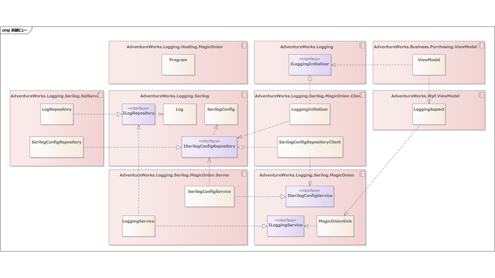
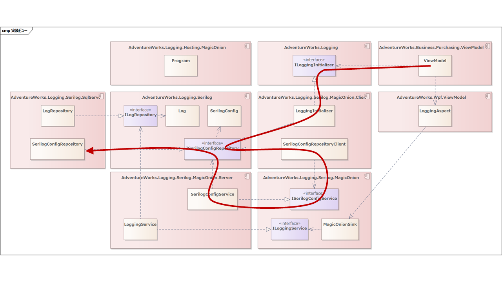

## ロギング実装ビューの設計

では先ほどの登場オブジェクトを、コンポーネントに割り振ってみましょう。



ひとまず問題なさそうです。

コードと流れをおって見ていきましょう。

### 初期化処理

つぎの流れで順番にみていきます。



アプリケーションの起動時、初期画面で認証を実施していた箇所に、ログ出力の初期化処理を追加します。

```cs
public class MainViewModel : INavigatedAsyncAware
{
    private readonly ILoggingInitializer _loggingInitializer;

    ・・・

    public async Task OnNavigatedAsync(PostForwardEventArgs args)
    {
        var authenticationResult = await _authenticationService.TryAuthenticateAsync();
        if (authenticationResult.IsAuthenticated
            && await _loggingInitializer.TryInitializeAsync())
        {
            await _presentationService.NavigateToMenuAsync();
        }
        else
        {
            _presentationService.ShowMessage(
                Purchasing.ViewModel.Properties.Resources.AuthenticationFailed,
                Purchasing.ViewModel.Properties.Resources.AuthenticationFailedCaption,
                MessageBoxButton.OK,
                MessageBoxImage.Error);

            // アプリケーションを終了する。
            Environment.Exit(1);
        }
    }
}
```

DIされたILoggingInitializerを呼び出してロガーを初期化します。初期化に失敗した場合は、ユーザー認証エラーでアプリケーションを終了します。

ILoggingInitializerの実装クラス、LoggingInitializerはつぎの通りです。

```cs
public class LoggingInitializer : ILoggingInitializer
{

    private readonly ApplicationName _applicationName;
    private readonly ILoggerFactory _loggerFactory;

    ・・・

    public async Task<bool> TryInitializeAsync()
    {
        // ロギングドメインの認証処理を行う
        AuthenticationService authenticationService = 
            new(new ClientAuthenticationContext(), LoggingAudience.Instance);
        var result = await authenticationService.TryAuthenticateAsync();
        if (result.IsAuthenticated is false)
        {
            return false;
        }

        // ロギング設定を取得する
        MagicOnionClientFactory factory = new(result.Context, Endpoint);
        var repository = new SerilogConfigRepositoryClient(factory);
        var config = await repository.GetClientSerilogConfigAsync(_applicationName);
#if DEBUG
        config = config with { MinimumLevel = LogEventLevel.Debug };
#endif

        // ロガーをビルドする
        var logger = config.Build();

        // ロギング設定を適用する
        MagicOnionSink.MagicOnionClientFactory = factory;
        LoggingAspect.Logger = 
            new SerilogLoggerProvider(logger)
                .CreateLogger(typeof(LoggingAspect).FullName!);

        return true;
    }
}
```

ApplicationNameとILoggerFactoryをDIして初期化を行います。ログを出力する際、購買・製造・販売のどのアプリケーションのログが出力したか判別したいため、ApplicationNameを利用します。

初期化処理ではまずAuthenticationServiceを利用して、ロギングドメインの認証を行います。

認証が成功したら、SerilogConfigRepositoryClientを利用してリモートから設定情報を取得します。このとき、アプリケーション名を指定して取得します。アプリケーション名を指定することで、個別のアプリケーションごとに設定が変更できるようにします。

設定情報を取得したらロガーをビルドして、MagicOnionSinkとLoggingAspectを初期化します。このとき、開発中はログを詳細にだしておきたいのでデバッグビルド時は、ログレベルを強制的にLogEventLevel.Debugに上書きしています。

LoggingAspectはSerilogには直接依存せず、Microsoft.Extensions.Hosting.Loggingのロガーを利用するため、SerilogLoggerProviderからロガーを生成しています。

全体としてはこのような流れになります。では詳細をもう少し掘り下げて見ていきましょう。

```cs
public class SerilogConfigRepositoryClient : ISerilogConfigRepository
{
    private readonly IMagicOnionClientFactory _clientFactory;

    public async Task<SerilogConfig> GetClientSerilogConfigAsync(ApplicationName applicationName)
    {
        var service = _clientFactory.Create<ISerilogConfigService>();
        return await service.GetServerSerilogConfigAsync(applicationName.Value);
```

SerilogConfigRepositoryClientはこれまでのMagicOnionのクライアント実装と相違ありません。IMagicOnionClientFactoryからサービスを生成して、リモートを呼び出します。

呼び出されたリモート側はつぎの通りです。

```cs
public class SerilogConfigService : ServiceBase<ISerilogConfigService>, ISerilogConfigService
{
    private readonly ISerilogConfigRepository _repository;

    public async UnaryResult<SerilogConfig> GetServerSerilogConfigAsync(string applicationName)
    {
        return await _repository.GetClientSerilogConfigAsync(new ApplicationName(applicationName));
    }
}
```

ISerilogConfigRepositoryを呼び出してその結果を返却しています。実体はSQL Server向けのSerilogConfigRepositoryクラスです。

```cs
public class SerilogConfigRepository : ISerilogConfigRepository
{
    ・・・
    public async Task<SerilogConfig> GetClientSerilogConfigAsync(ApplicationName applicationName)
    {
        return await GetSerilogConfigAsync(applicationName, new ApplicationName("Client Default"));
    }

    private async Task<SerilogConfig> GetSerilogConfigAsync(
        ApplicationName applicationName, 
        ApplicationName defaultName)
    {
        using var connection = _database.Open();

        const string query = @"
select
	ApplicationName, 
	MinimumLevel,
	Settings
from
	Serilog.vLogSettings
where
	ApplicationName = @Value";

        return await connection.QuerySingleOrDefaultAsync<SerilogConfig>(query, applicationName) 
               ?? await connection.QuerySingleAsync<SerilogConfig>(query, defaultName);
    }
}
```

ログの設定はアプリケーションごとに定義できると記載しました。ただ、つねに個別の設定がしたいわけではなく、通常時はデフォルトの設定を利用しておいて、障害時などに個別に設定が変更できるようにしたいです。

そのため、GetClientSerilogConfigAsyncを呼び出すと"Client Default"をデフォルト設定名として内部でGetSerilogConfigAsyncを呼び出しています。

まずは指定されたアプリケーション名で取得してみて、個別の定義がなければ"Client Default"の設定を取得して返却します。

SQLの中でSettings列が指定されていますが、ここに通常は設定ファイルに記載するフォーマットで設定を格納しておきます。これによってデータベース側の設定を更新することで、すべてのWPFアプリケーションに適用されるログ設定を変更可能にします。

取得した設定は、クライアント側でビルドされてロガーインスタンスを生成します。

```cs
public record SerilogConfig(ApplicationName ApplicationName, LogEventLevel MinimumLevel, string Settings)
{
    public ILogger Build()
    {
        var settingString = Settings
            .Replace("%MinimumLevel%", MinimumLevel.ToString())
            .Replace("%ApplicationName%", ApplicationName.Value);

        using var settings = new MemoryStream(Encoding.UTF8.GetBytes(settingString));
        var configurationRoot = new ConfigurationBuilder()
            .AddJsonStream(settings)
            .Build();

        global::Serilog.Log.Logger = new LoggerConfiguration()
            .ReadFrom.Configuration(configurationRoot)
#if DEBUG
            .WriteTo.Debug()
#endif
            .CreateLogger();

        return global::Serilog.Log.Logger;
    }
}
```

Settingsにはログレベルやアプリケーション名が変更できるように、置換文字列で記載しておいて、ビルド時に値を置き換えます。

その上で、置き換えられた設定からConfigurationBuilderを利用して設定オブジェクトをビルドします。そしてビルドされた設定からSerilogのロガーを生成します。

このとき、やはりデバッグ時はVisual StudioのDebugコンソールにも出したいので、WriteTo.Debug()を追加しています。

初期化処理はおおむねこの通りです。

### ログ出力処理

ではログ出力側のコードを見ながら流れを確認していきましょう。

先に説明した通り、ログの出力はViewModelのメソッド入り口で行われます。ただ個別に実装するわけではなく、LoggingAspectを織り込むことで行われます。

```cs
[PSerializable]
public class LoggingAspect : OnMethodBoundaryAspect
{
    public static ILogger Logger { get; set; } = new NullLogger<LoggingAspect>();

    public override void OnEntry(MethodExecutionArgs args)
    {
        var logLevel = GetLogLevel(args);
        Logger.Log(logLevel, "{Type}.{Method}({Args}) Entry", args.Method.ReflectedType!.FullName, args.Method.Name, args);
    }

    private static LogLevel GetLogLevel(MethodExecutionArgs args)
    {
        return args.Method.Name.StartsWith("On")
               || args.Method.GetCustomAttributes(true).Any(a => a is RelayCommandAttribute)
            ? LogLevel.Debug
            : LogLevel.Trace;
    }
}
```

OnMethodBoundaryAspectのOnEntryをオーバーライドすることで、メソッドの呼び出しをフックします。

呼び出されたメソッドをGetLogLevelに渡して、ログの出力レベルを判定します。画面遷移時とコマンドの呼び出し時はDebug、それ以外はTraceで出力する仕様なので、そのように判定します。

Kamishibaiを利用する場合、画面遷移イベントはOn～というメソッドを利用するためそれで判断します。画面遷移イベント以外にOn～を使うことは避けますが、Debugレベルのログは通常時は出力しない為、少々別のものが紛れ込んでも問題ないでしょう。

ViewModelのコマンドは、CommunityToolkit.Mvvmライブラリを利用して行います。具体的にはつぎのように記載します。

```cs
[RelayCommand]
private Task GoBackAsync() => _presentationService.GoBackAsync();
```

メソッドにRelayCommandAttributeを宣言することで、コード生成を利用して自動的にコマンドが作成されます。非常に便利なのでオススメです。

このようにコマンドを自動生成するため、メソッドにRelayCommandAttributeが宣言されているかどうかで、コマンドの呼び出しかどうかを判定しています。

LoggingAspectからILoggerを呼び出すと、内部的にMagicOnionSinkが呼び出されます。

```cs
public class MagicOnionSink : ILogEventSink
{
    private readonly LogEventLevel _restrictedToMinimumLevel;

    public async void Emit(LogEvent logEvent)
    {
        if (logEvent.Level < _restrictedToMinimumLevel)
        {
            return;
        }

        var service = MagicOnionClientFactory.Create<ILoggingService>();
        await service.RegisterAsync(
            new LogDto(
                ・・・
            ));
    }
}
```

先頭で呼び出されたログの出力レベルが、出力条件を満たしているか判定し、見たいしていない場合は早期リターンします。

条件を満たしたレベルであれば、MagicOnionClientFactoryを利用してILoggingServiceを生成し、リモートにログを送信します。

ここは細かな文字列編集などが多いため、一部のコードを省略していますので、詳細に興味があるかたはGitHubを直接ご覧ください。

ログを送信されたサーバー側はつぎのとおりです。

```cs
public class LoggingService : ServiceBase<ILoggingService>, ILoggingService
{
    private readonly ILogRepository _eventRepository;
    private readonly IAuthenticationContext _authenticationContext;

    public LoggingService(
        ILogRepository eventRepository, 
        IAuthenticationContext authenticationContext)
    {
        _eventRepository = eventRepository;
        _authenticationContext = authenticationContext;
    }

    public async UnaryResult RegisterAsync(LogDto logRecord)
    {
        await _eventRepository.RegisterAsync(
            new Log(
                ・・・
            ));
    }
}
```

JWTによる認証情報と、ILogRepositoryを利用してSQL Serverにログを保管します。ILogRepositoryの実装は繰り返しになるため、省略します。

こうしてログの出力設定をデータベース側に保管しておいて、任意のタイミングで出力レベルを調整できるようにしています。

その上でWPFアプリケーションの個別機能の実装側で特別な実装を行うことなく、抜け漏れ誤りなくログが出力できるようになりました。
