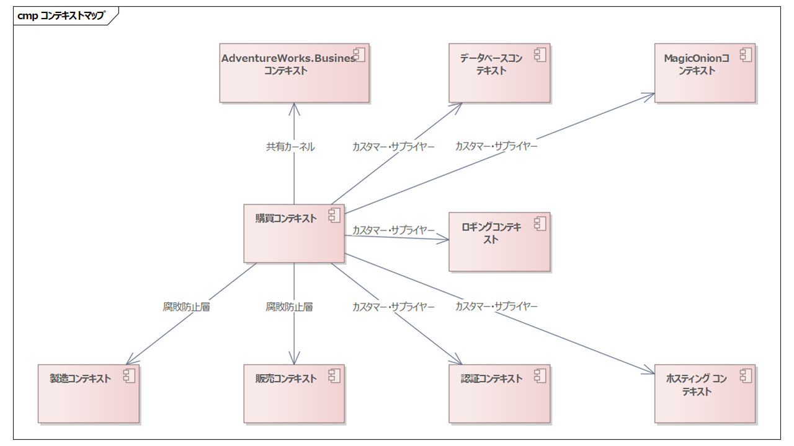

# 代表的なユースケースの実現

長くなりましたが、やっとユースケースを実装するための土台ができました。

ここからは個別のユースケースの実現を設計することで、WPFアプリケーション全体のアーキテクチャを完成させていきます。

あらためてユースケースビューを見てみましょう。

|No.|ユースケース|アーキテクチャパターン|代表|選定理由|
|--|--|--|--|--|
|1|ログインする|ログインパターン|✅|アプリケーション起動時の処理を実現するため。厳密にはログインはユースケースとは言えないかも知れないが、機能をユースケースで網羅するため含める。|
|2|発注する|基本パターン|||
|3|再発注する|基本パターン|✅|ユースケース固有の複雑な参照処理とそれを表示する高機能なグリッド、エンティティのCRUDが含まれるため。実際にはUとDは含まれないが、アーキテクチャ的にはCと差異がない。|
|4|・・・|・・・|||

今回は「ログインする」と「再発注する」の2つのユースケースを実現する過程で、アーキテクチャを煮詰めていきます。

つぎのような流れでユースケースを実現ます。

1. ユースケースの実現に必要なシナリオの一覧を洗い出す
2. 洗い出したシナリオを記述する
3. シナリオの記述を実現しながら、各ビューを完成させていく

## 「ログインする」ユースケースの実現

### シナリオ一覧

まずは「ログインする」を実現する上で、必要なシナリオを洗い出します。

|No.|シナリオ|説明|
|--|--|--|
|1|正常にログインする||
|2|認証に失敗する||

アーキテクチャを設計する上で必要になりそうなシナリオはこの2つでしょう。説明欄は、シナリオ名で十分な場合は省略しても構いません。むしろシナリオ名に含まれる内容を重複して含めた場合、読み手にムダな時間を強いることになりますし、修正時のコストも高くなり、メンテナンス性が低下します。意味なく重複した記述は避けるのが私の好みです。

では個別のシナリオを記述していきましょう。

### シナリオ「正常にログインする」

シナリオでは、ユーザーとシステムとの対話を記述します。前提条件と、事後条件も明確にしておくことがポイントです。

【前提条件】

* システムは起動していないこと

|No.|ユーザーの振る舞い|システムの振る舞い|
|--|--|--|
|1|システムを起動する|トップ画面を表示する|
|2||認証処理を行う|
|3||認証に成功する|
|4||メニュー画面を表示する|

【事後条件】

* システムはメニュー画面を表示している事

さてここでは、仕様を定義しているわけではなく、あくまでアーキテクチャを設計しています。そのため、この時点で正確な仕様は必要なく、アーキテクチャを設計できるレベルで十分です。

また今後このユースケース仕様を詰めていくうちに変更されたとしても構いません。その際に、アーキテクチャに影響する変更がなければ、この記述を修正する必要はありません。

あくまでも、アーキテクチャを設計する上で必要十分な仕様を定義することが目的です。

ではシナリオの「システムの振る舞い」にしたがって、実装を振り返りつつ、アーキテクチャを蒸留していきましょう。

#### トップ画面を表示する

まずはエントリーポイントのProgram.csを見てみましょう。

```cs
var builder = KamishibaiApplication<App, MainWindow>.CreateBuilder();

// MagicOnionのクライアントファクトリーをDIコンテナーに登録する。
builder.Services.AddSingleton(GetServiceEndpoint());
builder.Services.AddSingleton<IMagicOnionClientFactory, MagicOnionClientFactory>();

// 認証サービスを初期化する。
builder.Services.AddSingleton(PurchasingAudience.Instance);
var authenticationContext = new ClientAuthenticationContext();
builder.Services.AddSingleton(authenticationContext);
builder.Services.AddSingleton<IAuthenticationContext>(authenticationContext);
builder.Services.AddSingleton<IAuthenticationService, AuthenticationService>();

// ロギングサービスの初期化。
var applicationName = new ApplicationName("AdventureWorks.Business.Purchasing.Hosting.Wpf");
builder.Host.UseMagicOnionLogging(applicationName);

// MagicOnionのIFormatterResolverを準備する
FormatterResolverBuilder resolverBuilder = new();

// AdventureWorks.BusinessドメインのMagicOnionで利用するIFormatterResolverを登録する
resolverBuilder.Add(AdventureWorks.Business.MagicOnion.CustomResolver.Instance);

// View & ViewModelを初期化する。
// メニュー
builder.Services.AddPresentation<MainWindow, MainViewModel>();
builder.Services.AddPresentation<MenuPage, MenuViewModel>();

// MagicOnionのIFormatterResolverを初期化する
resolverBuilder.Build();

// アプリケーションのビルド
var app = builder.Build();

// 未処理の例外処理をセットアップする。
app.Startup += SetupExceptionHandler;
await app.RunAsync();
```

一般的なGeneric Hostを起動するコードですね。ただ正直、好みのコードとは言えません。このコードにはいくつかの問題があります。

まず大前提としてWPFアプリケーションは、購買アプリケーションだけでなく、製造・販売ドメインにも存在します。それらのアプリケーションでも、つぎのコードは完全に同じ形で登場するでしょう。

1. MagicOnionのクライアントファクトリーのDIコンテナーへの登録
2. 認証サービスのDIコンテナーへの登録
3. AdventureWorks.BusinessドメインのMagicOnionで利用するIFormatterResolverの登録

DIコンテナーの初期化コードは、意図しないところでバグを生みがちです。

たとえば購買アプリケーションを構築している途中に、認証サービスの修正が必要なことが判明して、DIコンテナーに登録するオブジェクトが増えたとしましょう。その場合、上述のProgram.csのコードを修正する必要があります。この時、本来は製造・販売ドメイン側の修正も必要になりますが、そういった影響範囲を常に正しく判断して管理することは難しいです。

またWPF間だけではなく、WPFとMagicOnionサーバー側でも同様の問題が発生します。MagicOnionで通信するためには、CustomResolverをクライアント側とサーバー側で同期をとってメンテナンスする必要がありますが、そういったところも抜けがちです。

そのため、各コンポーネントでDIコンテナーの初期化に必要な処理は、前述のロギングサービスの初期化のように、コンポーネント側に初期化用の拡張メソッドを用意しておくのが良いでしょう。

たとえば認証サービスであればつぎのような拡張メソッドを用意してはどうでしょうか？

```cs
public static class ServiceCollectionExtensions
{
    public static void UseJwtRestClient(this IServiceCollection services, Audience audience)
    {
        services.AddSingleton(audience);
        var authenticationContext = new ClientAuthenticationContext();
        services.AddSingleton(authenticationContext);
        services.AddSingleton<IAuthenticationContext>(authenticationContext);
        services.AddSingleton<IAuthenticationService, AuthenticationService>();
    }
}
```

するとProgram.csはつぎのようになります。

```cs
// 認証サービスを初期化する。

// Before
builder.Services.AddSingleton(PurchasingAudience.Instance);
var authenticationContext = new ClientAuthenticationContext();
builder.Services.AddSingleton(authenticationContext);
builder.Services.AddSingleton<IAuthenticationContext>(authenticationContext);
builder.Services.AddSingleton<IAuthenticationService, AuthenticationService>();

// After
builder.Services.UseJwtRestClient(PurchasingAudience.Instance);
```

このようにすることで、各コンポーネントの初期化処理をコンポーネント側に閉じ込めることができます。ではこれで良いか？というと実は不十分です。

認証処理の初期化コードのすぐ下につぎのようなコードがあります。

```cs
// ロギングサービスの初期化。
var applicationName = new ApplicationName(typeof(Program).Assembly.GetName().Name!);
builder.Host.UseMagicOnionLogging(applicationName);
```

認証処理ではbuilder.Serviceが使われていますが、ロギングサービスではbuilder.Hostが使われています。両方つかうコンポーネントがでてきてもおかしくありません。そのためIServiceCollectionの拡張メソッドでは初期化が実現できないケースが出てくる可能性があります。

となるとbuilderを渡したら良いのではないか？となりますが、builderはWPF側とASP.NET側で共通のインターフェイスが用意されていません。DIコンテナーの初期化は、各WPFアプリケーション間でも同期をとってメンテナンスする必要がありますが、WPFアプリケーションとASP.NETアプリケーション間でも同期をとってメンテナンスする必要があります。

DIコンテナーの初期化に誤りがあると、コンパイル時にはエラーにならなかったのに、起動してみたらDIコンテナーでエラーがでて、ぱっと見なにが悪いのか分からないなんてことは良くあります。このあたりがDIが難しいと感じさせている一因な気がします。

本来はbuilderが抽象化できて、WPFでもASP.NETでも同様に扱えると良いのですが、WebApplicationBuilderがプラットフォームに依存しないインターフェイスを持たない為、直接的に解決できません。

というわけで、WPFとASP.NETのbuilderを抽象化して共通で扱えるインターフェイスを作って、それぞれのアダプターを用意することで解決しましょう。

具体的には、プラットフォームに共通するつぎのようなインターフェイスを作成します。

```cs
public interface IApplicationBuilder
{
    IServiceCollection Services { get; }
    IConfiguration Configuration { get; }
    IHostBuilder Host { get; }
    FormatterResolverBuilder FormatterResolver { get; }
}
```

そしてWPF用の実装クラスを用意します。

```cs
public class WpfApplicationBuilder<TApplication, TWindow> : IApplicationBuilder
    where TApplication : Application
    where TWindow : Window

{
    private readonly IWpfApplicationBuilder<TApplication, TWindow> _applicationBuilder;

    public WpfApplicationBuilder(IWpfApplicationBuilder<TApplication, TWindow> applicationBuilder)
    {
        _applicationBuilder = applicationBuilder;
    }

    public IServiceCollection Services => _applicationBuilder.Services;
    public IConfiguration Configuration => _applicationBuilder.Configuration;
    public IHostBuilder Host => _applicationBuilder.Host;
    public FormatterResolverBuilder FormatterResolver { get; } = new();
}
```

ではあらためて、認証サービスの初期化拡張メソッドを用意しましょう。

```cs
public static class ApplicationBuilderExtensions
{
    public static void UseJwtRestClient(this IApplicationBuilder builder, Audience audience)
    {
        builder.Services.AddSingleton(audience);
        var authenticationContext = new ClientAuthenticationContext();
        builder.Services.AddSingleton(authenticationContext);
        builder.Services.AddSingleton<IAuthenticationContext>(authenticationContext);
        builder.Services.AddSingleton<IAuthenticationService, AuthenticationService>();
    }
}
```

これを類似箇所にすべてあてはめた後のProgram.csはつぎのようになります。

```cs
var kamishibaiBuilder = KamishibaiApplication<App, MainWindow>.CreateBuilder();
var builder = new AdventureWorks.Hosting.Wpf.WpfApplicationBuilder<App, MainWindow>(kamishibaiBuilder);

// MagicOnionのクライアントファクトリーをDIコンテナに登録する。
builder.UseMagicOnionClient(GetServiceEndpoint());

// 認証サービスを初期化する。
builder.UseJwtRestClient(PurchasingAudience.Instance);

// ロギングサービスの初期化。
var applicationName = new ApplicationName("AdventureWorks.Business.Purchasing.Hosting.Wpf");
builder.Host.UseMagicOnionLogging(applicationName);

// AdventureWorks.BusinessドメインのMagicOnionで利用するIFormatterResolverを登録する
builder.UseBusinessMagicOnion();

// View & ViewModelを初期化する。
builder.UsePurchasingView();

// MagicOnionのIFormatterResolverを初期化する
builder.FormatterResolver.Build();

// アプリケーションのビルド
var app = kamishibaiBuilder.Build();

// 未処理の例外処理をセットアップする。
app.Startup += SetupExceptionHandler;
await app.RunAsync();
```

だいぶスッキリしました。

ただよく見ると、購買・製造・販売のWPFアプリケーションで共通化できそうな処理がまだ含まれています。

1. WpfApplicationBuilderの初期化
2. MagicOnionのクライアントファクトリーの初期化
3. 認証サービスの初期化
4. ロギングサービスの初期化
5. FormatterResolverの初期化
6. 未処理の例外処理のセットアップ

とうことでWpfApplicationBuilderを少し拡張して、これらの処理をまとめてしまいましょう。

```cs
public class WpfApplicationBuilder<TApplication, TWindow> : IApplicationBuilder
    where TApplication : Application
    where TWindow : Window

{
    ・・・
    public static WpfApplicationBuilder<TApplication, TWindow> CreateBuilder()
    {
        return new(KamishibaiApplication<TApplication, TWindow>.CreateBuilder());
    }

    public IHost Build(ApplicationName applicationName, Audience audience)
    {
        // MagicOnionのクライアントファクトリーをDIコンテナに登録する。
        this.UseMagicOnionClient(GetServiceEndpoint());

        // 認証サービスを初期化する。
        this.UseJwtRestClient(audience);

        // ロギングサービスの初期化。
        this.Host.UseMagicOnionLogging(applicationName);
        
        // MagicOnionの初期化
        FormatterResolver.Build();
        
        // アプリケーションのビルド
        var app = _applicationBuilder.Build();

        // 未処理の例外処理をセットアップする。
        app.Startup += SetupExceptionHandler;
        return app;
    }
}
```

WpfApplicationBuilderをインスタンス化するstaticメソッドと、Buildメソッドを追加しました。そしてBuildメソッドの中で、2～6の処理をまとめています。

これでProgram.csはつぎのようになりました。

```cs
var builder = AdventureWorks.Hosting.Wpf.WpfApplicationBuilder<App, MainWindow>.CreateBuilder();

// View & ViewModelを初期化する。
builder.UsePurchasingView();

// アプリケーションのビルド
var applicationName = new ApplicationName("AdventureWorks.Business.Purchasing.Hosting.Wpf");
var app = builder.Build(applicationName, PurchasingAudience.Instance);

await app.RunAsync();
```

WPFで横断的に共通な処理はWpfApplicationBuilderに含めることで、アプリケーション固有の部分だけが残り、よりシンプルになりましたし、メンテナンス性も向上しました。

さて、これらの処理もデータベースや認証と同様の粒度なので、境界付けられたコンテキストとコンテキストマップを更新しましょう。




ホスティングは、先ほどのIApplicationBuilderが含まれるため、ほぼすべてから依存されます。そのため関連は省略しています。

今回開発しているシステムは、クライアントサイドもサーバーサイドもすべてGeneric Hostが前提となっています。そのため、Microsoft.Extensions.Hostingに依存していますが、Generic Host上のロガーインターフェイスであるILogger<T>がそのライブラリから依存されています。そのためホスティングコンテキストについても、ほぼすべてから依存されていても問題ないと判断しました。

むしろWPFとサーバーサイドでコンポーネントを共通化するにあたり、コンポーネントの初期化処理含めて共通化するために、WPF側もGeneric Hostに載せている側面があります。そのためMicrosoft.Extensions.Hostingに依存することは問題ありません。

つづいて、ではIApplicationBuilderなどを含めるために実装ビューを更新しましょう。


コンポーネントをフルネームで記述すると混雑しすぎるし、文字が小さくなりすぎるので、親のパッケージ名を省略しています。たとえば左上のBusinessコンポーネントはAdventureWorks.Businessが正式名称ですが、親のAdventureWorksを省略しています。

AdventureWorksドメインがトップにあり、その下にBusiness・Wpf・Logging・Authentication・MagicOnionの5つのサブドメインがあります。Businessサブドメインの下にはさらにPurchasingサブドメインがあります。

Purchasingサブドメインが、現在アーキテクチャ設計している購買システムになります。それ以外は、製造・販売システムからも共有される領域になります。

なお外部コンポーネントへの依存は、たとえばPurchasing.ViewModelもPostSharpなどに依存しますが、全部書くと線で埋まってしまいます。そのため推移的に依存することにして一部省略しています。

Hostingドメインが右下に追加し、HostingコンポーネントとHosting.Wpfコンポーネントに、それぞれIApplicationBuilderとWpfApplicationBuilderを追加しました。

さて、起動処理について整理が済みましたので、「トップ画面を表示する」続きを見直していきましょう。

さきほど、Program.csの中で、つぎのようなコードが含まれていました。

```cs
var builder = AdventureWorks.Hosting.Wpf.WpfApplicationBuilder<App, MainWindow>.CreateBuilder();

・・・

var app = builder.Build(applicationName, PurchasingAudience.Instance);
await app.RunAsync();
```

RunAsyncを呼び出すことで、MainWindowが起動されます。

MainWindowは、DIコンテナー初期化時に次のように登録されています。

```cs
builder.Services.AddPresentation<MainWindow, MainViewModel>();
```

そのため、MainWindow起動時にMainViewModelがDataContextにバインドされます。MainViewModelはINavigatedAsyncAwareを実装しているため、MainWindowが表示されたタイミングでOnNavigatedAsyncメソッドが呼び出されます。

```cs
public class MainViewModel : INavigatedAsyncAware
{
    ・・・
    public async Task OnNavigatedAsync(PostForwardEventArgs args)
    {
        ・・・
```

#### 認証処理を行う & 認証に成功する & メニュー画面を表示する

OnNavigatedAsyncメソッドの中で、認証処理を行います。このときシステム的には、販売サービスのgRPCとロギングサービスのgRPCに対して、認証処理を行う必要があります。

認証が成功したら、メニュー画面を表示します。

```cs
public class MainViewModel : INavigatedAsyncAware
{
    ・・・
    public async Task OnNavigatedAsync(PostForwardEventArgs args)
    {
        var authenticationResult = await _authenticationService.TryAuthenticateAsync();
        if (authenticationResult.IsAuthenticated
            && await _loggingInitializer.TryInitializeAsync())
        {
            await _presentationService.NavigateToMenuAsync();
        }```
```

ここはとくにアーキテクチャ的な修正はありませんね。ということで、シナリオ「正常にログインする」のアーキテクチャ設計は完了です。

### シナリオ「認証に失敗する」

では、次にシナリオ「認証に失敗する」を見ていきましょう。

【前提条件】

* システムは起動していないこと

|No.|ユーザーの振る舞い|システムの振る舞い|
|--|--|--|
|1|システムを起動する|トップ画面を表示する|
|2||認証処理を行う|
|3||認証に失敗する|
|4||認証失敗をアラートで通知する|
|5|アラートダイアログを閉じる|システムを終了する|


【事後条件】

* システムは終了していること

2までは成功時のシナリオと同じですね。

シナリオの記述は、差分が小さいことはありがちです。そのため、差分だけ記述してもよいですし、全体が小さいならすべて書いてしまっても良いでしょう。そこは単一のルールを定めず、使い分けるのが良いと思います。

なお実装的には、アーキテクチャに影響するような内容は含まれない為、ここでは省略します。
