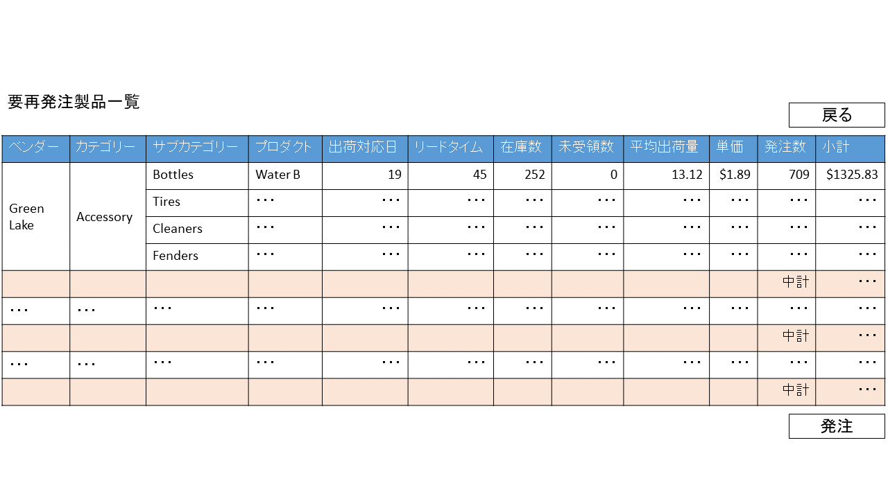
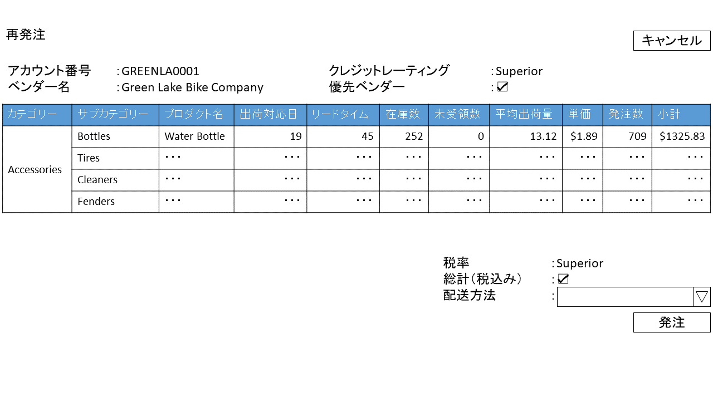
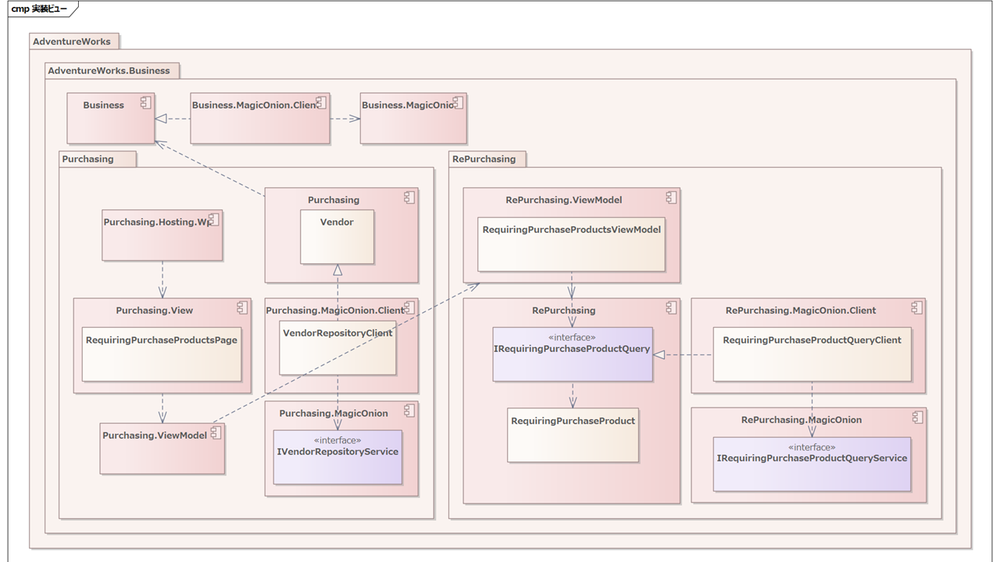
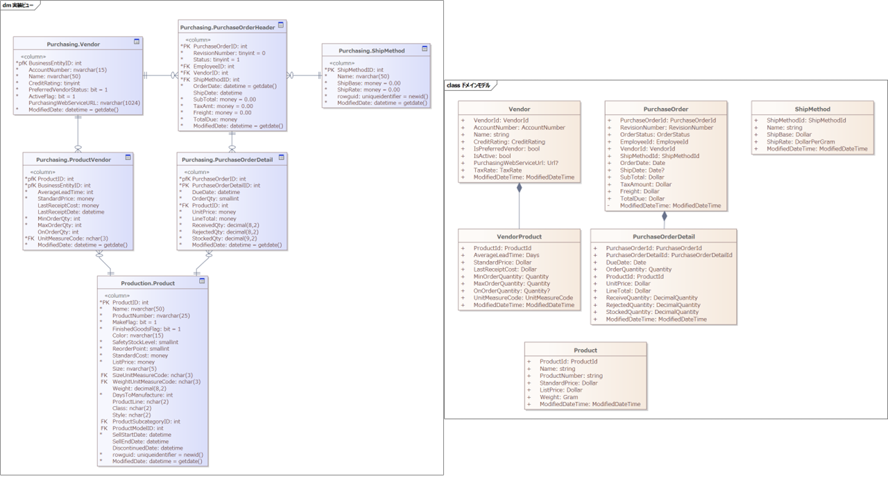
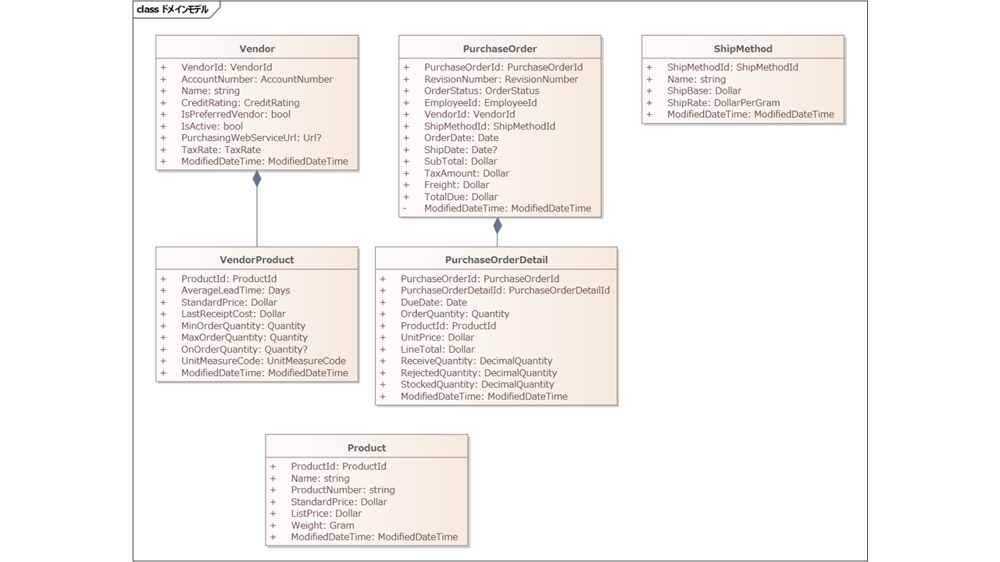

## 「再発注する」ユースケースの実現

さて、やっとここまできました。ユースケースを実現するためのアーキテクチャを設計していきましょう。

### シナリオ一覧

再発注するユースケースのシナリオ一覧は下記のとおりです。

|No.|シナリオ|説明|
|--|--|--|
|1|再発注する||
|2|・・・||

今回はユースケースの正常系となるシナリオ「再発注する」を取り上げることで、アーキテクチャ設計の手順を説明します。

### シナリオ「再発注する」

シナリオは下記のとおりです。

【前提条件】

- システムはメニュー画面を表示していること

|No.|ユーザーの振る舞い|システムの振る舞い|
|--|--|--|
|1|メニューから再発注を選択する|要再発注製品一覧画面に遷移する|
|2||再発注の必要な製品を表示する|
|3|再発注するベンダーを選択する|再発注画面に遷移する|
|4||選択されたベンダーと再発注が必要な製品の一覧を表示する|
|5|発注ボタンを押下する|発注する|
|6||発注が成功したことを、メッセージダイアログで表示する|
|7||要再発注製品一覧画面に遷移する|
|8||再発注の必要な製品を表示する|

【事後条件】

- 発注の明細がデータベースに登録されている
- システムは要再発注製品一覧画面に遷移し、再発注が必要な製品を表示している

シナリオにはいくつかの画面が登場します。この時点で正確な画面設計は不要ですが、まったくないのも進めずらいです。そこで、ざっくりしたスケッチを書いておくと良いでしょう。

この時点ではワイヤーフレームで十分です。紙芝居的にコミュニケーションにも使いたいので、私はPowerPointをよく利用しています。デザイン的な素養がない私でも使いこなせるので最高です。

#### 「要再発注製品一覧」画面



再発注が必要な製品の一覧を表示する画面です。この画面から再発注するベンダーを選択します。ベンダー列とカテゴリー列は、同一の行は結合して表示し、ベンダー単位で中計金額を表示します。

業務的には非常によくありがちな画面です。よくありがちで、案外大変な画面です。

業務アプリケーションではグリッドの操作性は命とも言えます。そのため、私の辞書には「グリッドを自作する」とういう言葉はありません。グリッドは必ずサードパーティ製のものを利用します。

この画面ではGrapeCityさんのSPREAD for WPFに含まれるGcSpreadGridコントロールを利用します。


GcSpreadGridは、高度なデータグリッド機能を提供するコンポーネントです。このグリッドは、Excelのような機能を持ち、セルの書式設定やフィルタリング、ソート、グループ化、集計、およびデータの編集など多様な操作を可能にします。大量のデータに対しても高速なパフォーマンスを提供するため、大規模なデータセットにも対応しています。またグリッドのデザイナーも提供されており、開発も容易です。

あまりに多機能なので、すべての仕様を文書化して仕様書を作ることは困難です。そのため、仕様上機能を大きく制限して、文書化できる範囲で利用しているケースがよく見られます。しかし、それは余りに勿体ないです。

そこで私はお客様とつぎのような合意の上で、大きな制限を設けずに利用することを提案しています。

「サードパーティコントロールで標準的に有効化されている機能は、システムの仕様書としては明記せず、その動作は、サードパーティの仕様に準拠するものとする。ユーザーテストにおいて十分に評価し、取り決められたテスト期間中に、受け入れ可能な範囲で詳細の変更は行う。リリース後、不具合をのぞき、サードパーティー製コントロールの挙動について瑕疵対応は行わない。」

一見責任放棄のようですが、顧客としては最高の操作性をもつグリッドを利用できるため、大抵の場合は受け入れて頂けます。そのために場合によって、事前にモックを活用してお客様に評価していただくこともあります。

受託開発の場合、この手の融通が利かないことで、開発側・ユーザー側双方の足かせになることがおおいです。しかしお客様と良い関係が築けていて、かつお客様が開発に理解を示してくれる場合は、このような合意を取り付けることを考えても良いのではないでしょうか？

#### 「再発注」画面



「要再発注製品一覧」画面で選択されたベンダーに対して再発注するための画面。配送方法を選択肢して再発注する。

### ユースケースとコンポーネント

さて、この時点で私が最初に考えるのは、ユースケースを実現する上でどうコンポーネントを分割するか？ということです。

ということで、現時点でWPFアプリケーションのコンポーネント構成を見てみましょう。Businessドメイン以外は省略します。


さてここで考えたいのは、ユースケースを実現するオブジェクトをどこに実装していくかです。

新たに実装するものはWPF上だけを考えるとつぎの5種類です。

1. View
2. ViewModel
3. 再発注ユースケースでのみ利用するオブジェクト
4. 3をサーバーから取得するクライアント実装
5. 4で利用するクライアントとサーバー間のインターフェイス定義

このうちViewだけはPurchasing.Viewの1つにまとめて、それ以外はユースケースごとに分割して実装することにします。

ユースケース間の依存関係は、丁寧に設計する必要があります。無作為に実装していると、ユースケース間で依存の循環が発生してしまいがちです。画面は双方向に移動するケースがあったり、ユースケース間で非常に似通ったオブジェクトが登場するからです。しかしここの依存関係が破綻すると、ユースケースの追加や変更が非常に困難になります。

これはドメインのどちらが上流・下流を設計するのと同じ意味があります。ユースケースの上流・下流をきちんと設計することで、仕様変更時の影響を適切に管理することができるようになります。依存関係が循環していると、がっちり密結合した状態になってしまって、どちらに手を入れても、どちらにも影響が発生する状況になりがちです。このため基本的にユースケースごとに独立したコンポーネントとすることで、依存関係を制御します。

ただしViewだけは例外とします。これはViewのスタイルやテーマを個別に分割していくと、メンテナンスが大変になったり、デザイナーでプレビューが正しく表示されなかったり、リソースディクショナリのロードが重くなったり・・・問題がおおくて私自身うまく解決できていない為です。何かいい方法があれば、ぜひ教えてください。

では具体的にどうするか？ということで、いったん次のようにしてみました。


メニューのViewModelが含まれるPurchasing.ViewModelから、要再発注製品一覧画面のViewModelを呼び出して画面遷移します。そのコンポーネントがRePurchasing.ViewModelです。

要再発注製品一覧画面では、RePurchasingコンポーネント内のユースケースオブジェクトを利用して画面を表示します。

その際、サーバーサイドを呼び出して必要な情報を取得します。そのクライアントはRePurchasing.MagicOnion.Clientに含まれています。

クライアントはサーバーのMagicOnionで実装されたWeb APIを呼び出します。そのクライアントとサーバー間のインターフェイス定義がRePurchasing.MagicOnionに含まれています。

悪くなさそうですね。ではシナリオにしたがって設計・実装してみましょう。

#### 要再発注製品一覧画面に遷移する

```cs
[Navigate]
public partial class MenuViewModel
{
    private readonly RePurchasing.ViewModel.IPresentationService _presentationService;

    public MenuViewModel(
        [Inject] RePurchasing.ViewModel.IPresentationService presentationService)
    {
        _presentationService = presentationService;
    }

    [RelayCommand]
    private Task NavigateRePurchasingAsync() => 
        _presentationService.NavigateToRequiringPurchaseProductsAsync();
}
```

メニュー画面で再発注ボタンを押下したとき、ViewModelのCommandを呼び出します。Commandの実装は多様な方法がありますが、今回はCommunityToolkit.Mvvmというライブラリを利用します。

CommunityToolkit.Mvvmでは上述のようにRelayCommand属性を付与することで、自動的にCommandを生成してくれます。非常に便利なのでぜひ利用してみてください。

#### 再発注の必要な製品を表示する

再発注一覧画面は画面全体とは別にグリッド部分をユーザーコントロールとして実装します。このコントロールはSPREAD for WPFのデザイナーを利用して作成します。


SPREAD for WPF自体、Excelライクなグリッドを実装するためのコンポーネントですが、見てのとおりデザイナーもExcelライクな操作感になっています。比較的容易にグリッドをデザインできます。

WPFなのでプレゼンテーションはMVVMパターンを適用して実装します。View側からはViewModelをバインドしますが、このときXAML上でVisual StudioのIntelliSenseを利用してバインドするため、デザイン時ViewModelを適用することを強くオススメします。そうしておかないと、バインド時のプロパティ指定ミスが地味に多くなるからです。

```xaml
<UserControl ・・・
             d:DataContext="{d:DesignInstance {x:Type local:RequiringPurchaseProductsDesignViewModel}, IsDesignTimeCreatable=True}"
             mc:Ignorable="d" 
             d:DesignHeight="450" d:DesignWidth="800">
```

こんな感じでXAML側にRequiringPurchaseProductsDesignViewModelを指定します。デザイン時のViewModelは、私はxaml.csにあわせて定義しています。他で利用しないためです。デザイン時ViewModelはコード生成を検討したほうが良いかもしれません。

```cs
using AdventureWorks.Business.Purchasing.RePurchasing.ViewModel;

namespace AdventureWorks.Business.Purchasing.View.RePurchasing;

public partial class RequiringPurchaseProductsPage
{
    public RequiringPurchaseProductsPage()
    {
        InitializeComponent();
    }
}

public class RequiringPurchaseProductsDesignViewModel : RequiringPurchaseProductsViewModel
{
    public RequiringPurchaseProductsDesignViewModel() :
        base(default!, default!, default!)
    {
    }
}
```

実際のViewModelはDIを使う関係で、デフォルトコンストラクターは存在しない事が多いです。そのため、実際のViewModelを継承したデォルトコンストラクターをもつデザイン時ViewModelを作成してバインドして利用します。

さて、肝心の再発注対象の一覧をどのように取得しましょうか？

ドメイン駆動設計の場合、ドメインの登場オブジェクトを抽象化したエンティティクラスが存在します。しかし、要再発注製品一覧画面のグリッドで表示する1行を表すオブジェクトは、多数のエンティティから取得した情報を組み合わせたものになります。


この場合、必要な情報をエンティティのまた取得してきて、プレゼンテーション層で組み立てるようにすると、一覧画面で必要となる性能がでないことも多いです。

そこでCQRSパターンを活用します。

CQRSは、「コマンドクエリ責務分離」の略で、データベースに対する読み取り操作（クエリー）と書き込み操作（コマンド）を別々に扱うアーキテクチャのことです。

書き込み側の操作はDDDのエンティティを利用しますが、ユースケース時の複雑な情報の取得は読み取り専用のクエリーオブジェクトを利用します。データベースの読み取り操作には最適化されたクエリを使用することで、パフォーマンスの改善を期待できますし、プレゼンテーション層の実装も容易になります。またクエリーオブジェクトは、エンティティをユースケース視点で抽象化したものなので、実際のデータの持ち方を隠蔽できます。

私個人の経験として実際にそれで救われたことがあります。

私は業務アプリケーションでRDBを利用する場合、まずは基本的に、十分に正規化された形で保持するように設計します。そのように設計すると、複雑な検索が存在する場合に、多数の結合を利用した複雑なクエリーが必要になることがあります。そして、システムの利用が拡大した結果、どうしても十分な性能が出ない状態になりました。利用料が当初想定より一桁増えてしまったので、流石に厳しかったです。

そこでデータを保存する際に、正規化されたデータとは別に、検索に適した形で非正規化したテーブルを作っておき、検索時に利用するように改修しました。

WPF側では、検索サービスにクエリーオブジェクトを利用していた結果、C#のプログラム改修を一切なしに、検索性能を改善することができました。登録側もデータベーストリガーを利用しました。

とうわけで要検索製品一覧画面のレコードは、エンティティではなく、RePurchasingコンポーネント内に、RequiringPurchaseProductクラスを作成します。

```cs
public record RequiringPurchaseProduct
{
    public RequiringPurchaseProduct(
        VendorId VenderId,
        string VendorName,
        ProductCategoryId ProductCategoryId,
        string ProductCategoryName,
        ・・・
```

プロパティが多すぎるので、省略しますが、雰囲気は伝わるとおもいます。フラットな構造になっています。

そしてエンティティに対するリポジトリーに該当する、クエリーオブジェクトに対するクエリーサービスをPurchasingコンポーネントに作成します。

```cs
namespace AdventureWorks.Business.Purchasing.RePurchasing;

public interface IRequiringPurchaseProductQuery
{
    Task<IList<RequiringPurchaseProduct>> GetRequiringPurchaseProductsAsync();
}
```

そしてこのクエリーサービスのMagicOnion実装を、Purchasing.MagicOnion.Clientに定義します。

```cs
public class RePurchasingQueryClient : IRePurchasingQuery
{
    ・・・
    public async Task<IList<RequiringPurchaseProduct>> GetRequiringPurchaseProductsAsync()
    {
        var client = _clientFactory.Create<IRequiringPurchaseProductQueryService>();
        return await client.GetRequiringPurchaseProductsAsync();
    }
}
```

MagicOnionを利用するには、それに適したインターフェイスを定義する必要があります。それが_clientFactoryから生成しているIRequiringPurchaseProductQueryServiceです。

IRequiringPurchaseProductQueryServiceはクライアントとサーバー間で共有するインターフェイスなので、Purchasing.MagicOnionに定義します。

では、ここまでの実装をモデルに反映します。


#### 再発注画面に遷移する

ベンダーを選択肢、発注ボタンを押下されたら、再発注画面に遷移します。

再発注画面ではベンダーの詳細情報が必要になります。しかし要再発注製品一覧画面のクエリーモデルには、ベンダーIDと名称くらいしかもっていません。

ベンダーは画面遷移前と遷移後と、どちらで取得することもできますが、ここでは画面遷移前に取得します。遷移後の画面ではベンダーの情報を表示するために、ViewModelのベンダー情報をViewでバインドします。

遷移後で取得した場合、遷移後のViewModelのプロパティでnullを許可する必要があります。

逆に、遷移前に取得してから渡す場合、コンストラクターで注入することができるため、nullは不許可に設計できます。

そのため、遷移前に取得してから渡すことにします。

```cs
[Navigate]
public partial class RequiringPurchaseProductsViewModel : 
    INavigatedAsyncAware
{
    [RelayCommand]
    private async Task PurchaseAsync()
    {
        var vendor = await _vendorRepository.GetVendorByIdAsync(_selectedRequiringPurchaseProduct!.VendorId);

        await _presentationService.NavigateToRePurchasingAsync(vendor);
    }
}

```

遷移Commandは、メニューからの遷移と同様にRelayCommandを利用して生成します。やはり便利です。とくに非同期メソッドも何も考えずに利用できるのは、非常に便利です。

またKamishibaiを利用することで、画面遷移時の引数を、つぎの画面のコンストラクターに型安全に渡すことができます。

さて、Vendor関連を実装ビューに反映しましょう。



悪くないですね。

#### 選択されたベンダーと再発注が必要な製品の一覧を表示する


この画面では、ベンダーの情報と、再発注が必要な製品の一覧を表示します。

この画面でアーキテクチャ的に重要なポイントは、プルダウンコントロールくらいでしょうか。

プルダウンもなかなか奥深いコントロールです。業務アプリケーションのプルダウンとなると、個人的には検索可能なプルダウンはどうしても欲しいと思います。そうなるとやはり自作は大変です。

ということで、やはりサードパーティのコンポーネントスイートを利用した方が良いでしょう。

サードパーティのコンポーネントスイートを利用する場合、プルダウンのような標準に含まれるコンポーネントがある場合もありますが、基本的にはコンポーネントスイート側のものを利用するようにします。これはデザインのテイストなどを統一するためです。

#### 発注する

さて、発注するにあたって、要再発注製品一覧画面のクエリーオブジェクトから、発注オブジェクトを作成する必要があります。ここでドメイン駆動設計における集約の悩みが生まれてきます。

下図は、左がデータモデルで、右が今回設計したドメインモデルです。



どちらも5つのオブジェクトが登場します。細かい名前は、それぞれのお作法や視点がやや異なるためです。

|データモデル|ドメインモデル|説明|
|--|--|--|
|Vendor|Vendor|製品の発注先ベンダー|
|ProductVendor|VendorProduct|製品の取り扱いベンダー。発注ドメインから見た場合、Vendorの子オブジェクトなので名前を入れ替えた。|
|Product|Product|製品|
|PurchaseOrderHeader|PurchaseOrder|発注。ドメインモデル側でHeaderがないのは、一般的に集約的なオブジェクトがあった場合、ルートオブジェクトは集合全体を扱う名称にすることが多いため。|
|PurchaseOrderDetail|PurchaseOrderDetail|発注明細|
|ShipMethod|ShipMethod|支払方法|

さて最大の違いは見ての通り、オブジェクト間の関係です。

データモデルは、RDBであるSQL Serverのサンプルデータベースですから、リレーションモデルで設計されています。十分に正規化されており、関連するオブジェクト間の関係はすべてリレーションで表現されています。

ドメインモデルは、集約の単位でリレーションが分割されています。ドメインモデルではリレーションで表現されていたけど、ドメインモデルではリレーションで表現されていない箇所は、IDで表現されています。ひとつながりのオブジェクトの範囲をドメイン駆動設計では集約と呼びます。

オブジェクト指向設計でRDBと同じリレーショナルモデルを表現した場合、巨大になりすぎてしまいます。

もちろん遅延リードのような仕組みを利用することもできます。しかし、遅延リードのような仕組みは、いつ遅延リードが行われるのか、透明性が失われます。遅延リードの実行有無によってオブジェクトの一貫性が損なわれることもあります。また遅延リードを行うという事は、エンティティ内にリポジトリーの仕組みを含まることになります。これはエンティティを複雑化し、エンティティがドメインロジックの本質に注力することが難しくなります。

このような理由から遅延リードのような仕組みは基本的に用いず、集約を設計することが推奨されています。

ではデータモデルのような連続的なリレーショナルモデルから、集約のような不連続のモデルを設計するとき場合、どのような指針に基づくべきでしょうか？

オブジェクト指向において、オブジェクト間の関連は大きく次の3種類に分けられます。

|関係|説明|
|--|--|
|関連 (Association)|オブジェクト間の一般的な関係を示します。関連は、通常、一つのオブジェクトが別のオブジェクトを使用する場合に発生します。関連は双方向または単方向であり、一対一、一対多、多対多などのカーディナリティを持つことができます。図上の実線で表す。|
|共有集約 (Aggregation)|オブジェクト間の"全体-部分"関係を表します。この関係では、あるオブジェクトが他のオブジェクトの集合を持ち、それらをグループ化しています。ただし、部分オブジェクトは独立して存在でき、複数の集約オブジェクトと共有されることがあります。共有集約では、全体オブジェクトが破棄されても部分オブジェクトは存続します。図上で親側に白抜きの菱形のついた実線で表す。未登場。|
|コンポジション (Composition)|より強い"全体-部分"関係を表します。これは、あるオブジェクトが他のオブジェクトの集合を持ち、それらをグループ化している点では共有集約に似ていますが、部分オブジェクトは全体オブジェクトに完全に依存しています。全体オブジェクトが破棄されると、部分オブジェクトも自動的に破棄されます。この関係は独占的で、部分オブジェクトは一つの全体オブジェクトにのみ属します。図上で親側に黒塗りの菱形のついた実線で表す。|


下図は、さきほどのオブジェクトの概念を純粋にモデル化したものです。


発注はベンダーに対して行われ、ベンダーが存在しなければ、その発注は発生しません。同様に発注明細も発注の一部です。

発注と配送方法の間には関連があります。しかし、どちらがどちらの一部とは言えません。

ベンダーと製品の関係も同様ですが、それらの間にはベンダーがどのような製品を取り扱っているのか表す、ベンダー製品という概念が存在します。

発注明細は製品が存在しなければ発生しませんが、製品からみると発注明細は、製品の一部ではないため、関連として表現しています。

これらを集約として分割していくにあたり、私はつぎのような指標を設けています。

|関係|説明|
|--|--|
|関連 (Association)|集約に含めない|
|共有集約 (Aggregation)|集約に含めない|
|コンポジション (Composition)|基本的に含めるが、つぎの2つは含めない<br>1. マスター・トランザクションのようなライフサイクルが大幅に異なるオブジェクト<br>2. 画像や動画のような大きなバイナリー|

この指標にしたがって分割した結果が下図の通りです。



さて、ここで私が一番悩んだのは、発注オブジェクト（PurchaseOrder - PurchaseOrderDetail）をどのように組み立てるか？とうことです。PurchaseOrderオブジェクトを作って、そこにPurchaseOrderDetailを1つずつ追加していくのがもっとも直感的ではあります。しかし実はそれは困難です。

一番分かりやすいのは、配送料（Freight）です。

配送料は、発注対象の総重量に配送方法のグラムあたりの単価である配送レートを掛けたものです。そのため配送料は、発注明細が追加されるたびに再計算する必要があります。しかし、発注オブジェクトには配送方法は含まれないため、配送料を計算することができません。

一番簡単な解決策は、配送ボタンを押下された際に呼ばれるViewModelで、配送明細をすべて作成して、配送料を計算してから配送オブジェクトを生成する方法です。しかしそうしてしまうと、ViewModel側にビジネスロジックが漏れ出してしまします。何のためのドメイン層なのかということになってしまいます。

そこで今回はビルダークラスを作成して解決することとしました。コードを見ながら説明しましょう。

まずはビルダークラスを使うコードです。

```cs
// ビルダー生成に必要なオブジェクトを集めて、発注ビルダーを生成する
EmployeeId employeeId = ...
Vendor vendor = ...
ShipMethod shipMethod = ...
Date orderDate = ...
var builder = new PurchaseOrderBuilder(employeeId, vendor, shipMethod, orderDate);

// 要再発注製品の一覧
IEnumerable<RequiringPurchaseProduct> requiringPurchaseProducts = RequiringPurchaseProducts;
foreach (var requiringPurchaseProduct in requiringPurchaseProducts)
{
    var product = await _productRepository.GetProductByIdAsync(requiringPurchaseProduct.ProductId);
    // 製品と数量を指定して明細を追加する。
    builder.AddDetail(product, requiringPurchaseProduct.PurchasingQuantity);
}

// 発注をビルドする
PurchaseOrder purchaseOrder = builder.Build();
```

ビルダークラスは、発注オブジェクトを生成するために必要な情報を集めて、最後にBuildメソッドを呼び出すことで、発注オブジェクトを生成します。

その際にビルダークラスに配送方法を渡しておくことで、ビルド時に配送料を計算することが可能になります。なお下記のコードは問題にフォーカスするため、実際のコードとはやや異なります。

```cs
private readonly List<(Product Product, Quantity Quantity)> _details = new();

public void AddDetail(Product product, Quantity quantity)
{
    _details.Add((product, quantity));
}

public PurchaseOrder Build()
{
    DollarPerGram shipRate = _shipMethod.ShipRate;
    Gram totalWeight = _details
        .Select(x => x.Product.Weight * x.Quantity)
        .Sum();
    Dollar freight = shipRate * totalWeight;
```

やっとバリューオブジェクトの価値を説明することができるようになりました。

配送料は、発注対象の総重量に配送方法のグラムあたりの単価である配送レートを掛けたものです。

このとき配送レートや重量、金額はintはdecimalといった .NETで提供されるプリミティブ型を利用して実装することもできます。しかしその場合、誤って別の数字を計算にもちいてしまってバグが発生する可能性があります。

そこで重量単価（DollarPerGram）、グラム、ドルといったバリューオブジェクトを作成して、それらを使って計算することで、誤って別の数字を計算にもちいてしまうことを防ぐことができます。

とくに業務アプリケーションの場合、多様な数値を扱います。このときにプリミティブ型を利用してしまうと、どの数値がどのような意味を持っているのかが分かりにくくなってしまいます。そこでバリューオブジェクトを利用することで、数値の意味を明確にできます。

たとえばグラムは足し引きはできますが、掛け算はできません。しかしグラムをintで扱ってしまうと、掛け算を防ぐことはできません。そういったドメインロジックを値毎に明確に実装できることがバリューオブジェクトの価値です。

業務アプリケーションの場合、本当に多様なバリューオブジェクトが発生してきます。本稿ではバリューオブジェクトの実装にUnitGeneratorライブラリを利用しています。非常に便利なライブラリなのでオススメです。

こうしてビルドしたPurchaseOrderオブジェクトはリポジトリーを利用して登録して、発注を完了します。

このあたりのドメイン駆動的な設計は、ユースケースの実現を通すことで見えてきます。

#### 発注が成功したことを、メッセージダイアログで表示する

アラートの表示はKamishibaiでViewModel側から利用する仕組みが用意されているので、これを利用します。

```cs
_presentationService.ShowMessage(Purchasing.ViewModel.Properties.Resources.RegistrationCompleted);
```

#### 要再発注製品一覧画面に遷移する

要再発注製品一覧画面に遷移するには、KamishibaiのIPresentationServiceを利用して、前の画面に戻ります。

```cs
await _presentationService.GoBackAsync();
```

#### 再発注の必要な製品を表示する

要再発注製品一覧画面を最初に遷移してきたときは、INavigatedAsyncAwareのOnNavigatedAsyncを実装して、再発注の必要な製品を表示しました。INavigatedAsyncAwareは画面が前に遷移したときに呼ばれるインターフェイスです。

戻ってきたときはIResumingAsyncAwareを利用します。

```cs
[Navigate]
[INotifyPropertyChanged]
public partial class RequiringPurchaseProductsViewModel : 
    INavigatedAsyncAware,
    IResumingAsyncAware
{
    ・・・
    public async Task OnResumingAsync(PreBackwardEventArgs args)
    {
        RequiringPurchaseProducts.Replace(
            await _requiringPurchaseProductQuery.GetRequiringPurchaseProductsAsync());
    }
```

実際の処理自体は変わりません。

これで「再発注する」ユースケースが実装できました。これでデータソーサのCRUDを実現する目途が立ちました。

